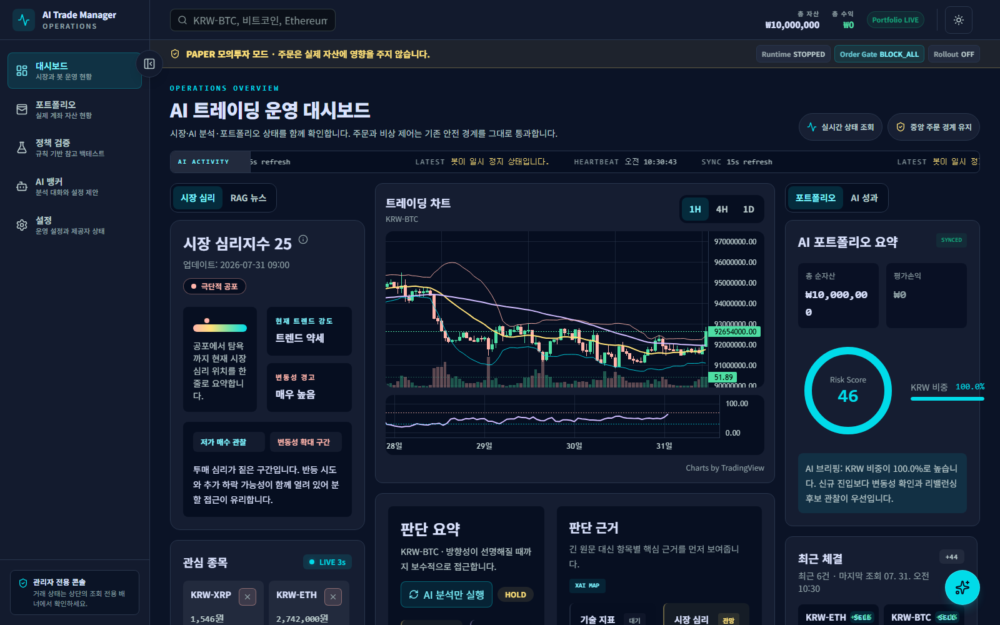
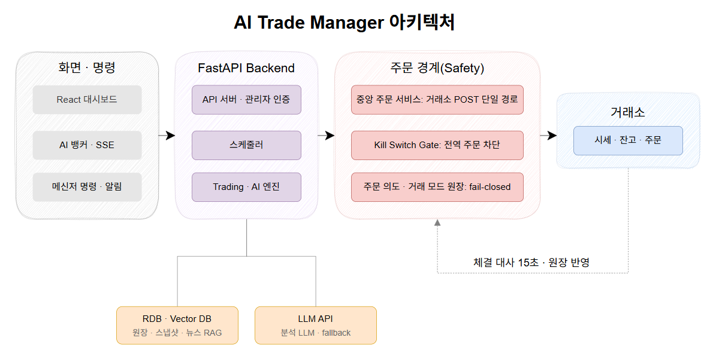

# AI-Trade-Manager

Upbit 원화 현물을 대상으로 AI 분석과 RAG 뉴스를 매매 판단에 쓰는 개인용 트레이딩 운영 시스템.

  

> 중요한 건 매수 버튼을 누르는 게 아니라, 누르면 안 될 때를 막는 것이었다.

판단 근거와 주문 앞뒤 상태를 나중에 다시 확인할 수 있게 남기는 쪽에 무게를 뒀습니다.

- [개발 블로그](https://kaero313.github.io/AI-Trade-Manager/) — 만든 이유와 겪은 문제
- [운영 기록 허브](https://torpid-icon-d8a.notion.site/AI-Trade-Manager-3724054272b580d0b968f323059761da) — 설계 근거와 케이스별 상세

## 구조와 안전 규칙

  

시장 데이터, 기술 지표, 포트폴리오, RAG 뉴스, 과거 판단 피드백을 묶어 매수 / 매도 / 보류 분석을 만듭니다.
실행까지 가려면 아래를 다시 통과해야 합니다.

| 규칙 | 내용 |
| :--- | :--- |
| 불확실 시 매수 차단 | 리스크 판정이 불명확하거나 결과가 없을 때 |
| 신규 진입만 차단 | 매도, 비상청산, 정합성 복구와 AI 분석은 계속 동작 |
| 실거래는 3단계 분리 | live 전환 · 런타임 시작 · 주문 게이트 해제, 자동 연쇄 없음 |
| 주문 멱등성 | 주문 의도와 거래소 id를 먼저 확정, 재전송 대신 조회로 복구 |
| 완료 판정 | 미체결 0, 잔고 0, 원장 일치를 확인한 것만 완료 |
| 판단 추적 | provider, model, 부모 분석, prompt 버전, context 해시 |
| 누락 데이터 표시 | RAG 저하와 데이터 누락을 정상값으로 보정하지 않음 |

초기 상태는 `paper + inactive + BLOCK_ALL`입니다.

## 하네스 엔지니어링

AI 코딩 에이전트(Claude Code, Codex)가 이 저장소에서 일하는 방식을 역할·절차·검증으로 정해 두고, 그 설정을 코드와 함께 버전 관리합니다. 두 도구는 같은 규칙 파일과 역할 정의를 쓰고, 도구별 설정 파일은 생성기로 만듭니다.

  

검증 게이트의 앱 기동 확인은 테스트를 통과하고도 앱이 뜨지 않은 일을 겪은 뒤 추가했고, 영향 분석의 텍스트 검색 교차 확인은 코드 그래프가 호출 일부를 놓친 것을 확인한 뒤 추가했습니다.

| 역할 | 모델 (Claude / Codex) | 추론 | 권한 | 맡는 일 |
| :--- | :--- | :--- | :--- | :--- |
| lead | Opus 5.5 / GPT-6 Sol | xhigh | 쓰기 | 사람과 대화하며 범위 판단, 작업 분배, 통합 |
| scout | Sonnet 5 / GPT-6 Luna | low | 읽기 전용 | 코드 경로와 영향 범위 조사 |
| backend | Opus 5.5 / GPT-5.6 Terra | high | 쓰기 | API·DB·트레이딩 로직과 테스트 |
| frontend | Opus 5.5 / GPT-5.6 Terra | high | 쓰기 | 대시보드 |
| qa | Opus 5.5 / GPT-6 Sol | high | 쓰기 | 실주문·청산·거래 모드·인증 변경의 테스트를 구현과 따로 작성 (테스트만 수정) |
| reviewer | Opus 5.5 / GPT-6 Sol | xhigh | 읽기 전용 | 실주문·청산·거래 모드·인증 관련 변경 독립 검토 |

## 기술 스택

| 영역 | 스택 |
|---|---|
| Backend | FastAPI, Async SQLAlchemy 2.0, Alembic, APScheduler |
| Frontend | React, TypeScript, Vite, TanStack Query, Recharts, lightweight-charts |
| Data | PostgreSQL, OpenSearch |
| AI | LangGraph, Gemini, OpenAI, RAG, Embeddings |
| External | Upbit, Slack, Telegram, RSS / CryptoPanic |
| Infra | Docker, Docker Compose |
| Dev | Claude Code, Codex, GitNexus, pytest, Vitest, GitHub Actions |

## 문서

- [아키텍처 노트](docs/ARCHITECTURE.md) — 구조, 안전장치, 실주문 제어
- [데이터 모델 노트](docs/DATABASE.md)
- [운영 가이드](docs/OPERATIONS.md)
- [개발 워크플로우](docs/DEVELOPMENT_WORKFLOW.md) — 개발 하네스 설정·사용법·변경 이력

기능별 설계·구현 기록은 [`docs/plans`](docs/plans), 검증 기록은 [`docs/reviews`](docs/reviews)에 있습니다.
