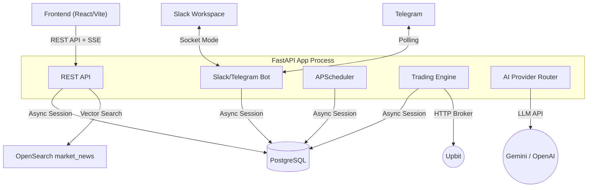
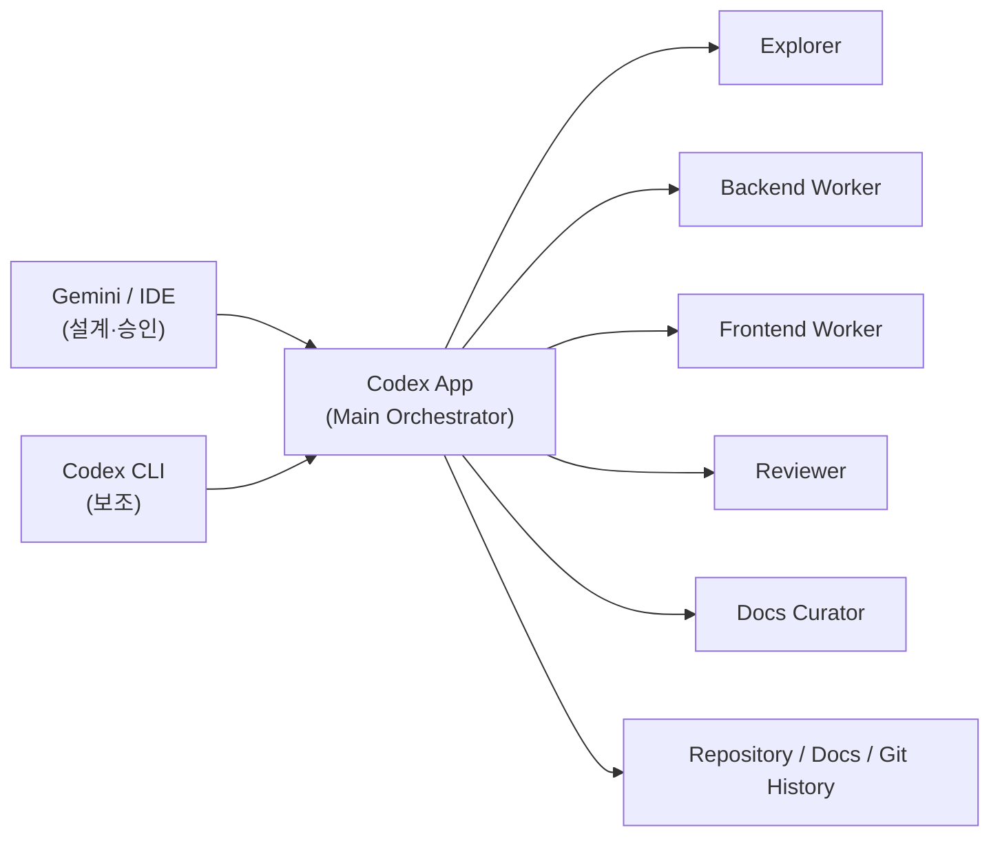
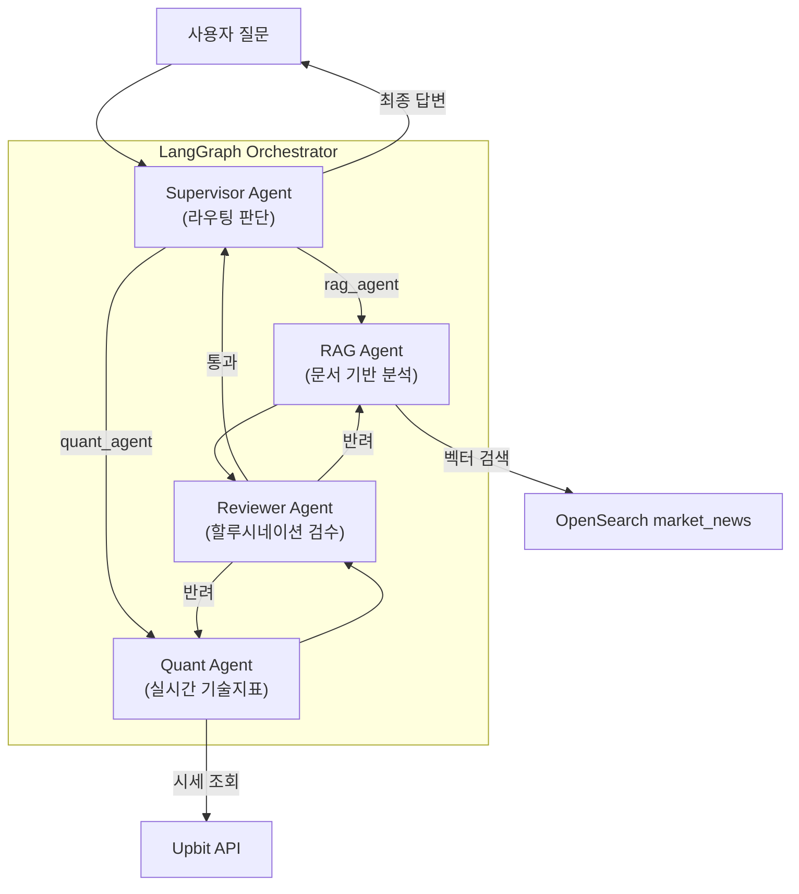

# AI-Trade-Manager 아키텍처 명세서 (Architecture Specification)

본 설계 문서는 **AI-Trade-Manager** 프로젝트의 시스템 구조와 기술 스택 선택의 의도를 설명합니다.
모든 개발(특히 Codex)은 이 문서를 최우선 기준으로 삼아 구조적 일관성을 유지해야 합니다.

> **최종 갱신 기준:** Phase 48 (RAG 비용 절감 및 BUY 민감도 조정)
>
> 이 문서는 현재 구조 설명을 우선합니다. 하단의 버전 항목은 구현 발전 이력으로 보며, 최신 런타임 구조는 1~6장을 기준으로 판단합니다.

---

## 1. 핵심 철학 (Core Philosophy)
1. **관심사의 완벽한 분리 (Decoupling):** 백엔드(FastAPI)는 오직 JSON 데이터만 서빙하며, 모든 UI 렌더링은 프론트엔드(React)가 전담합니다.
2. **비동기 최우선 (Async-First):** 네트워크 병목 현상(거래소 API 호출)과 DB I/O가 잦은 트레이딩 봇의 특성을 고려하여 모든 I/O 작업은 `async/await` 구조를 따릅니다.
3. **장애 전파 최소화 (Fault Tolerance):** 거래소, RAG, AI provider 장애가 전체 앱 중단으로 이어지지 않도록 상태를 기록하고 fallback/skip 경로를 둡니다.
4. **AI-First 설계:** LLM 기반 멀티에이전트 오케스트레이션을 통해 자율 매매 판단, 시장 분석, 포트폴리오 관리를 지능적으로 수행합니다.

## 2. 시스템 아키텍처 (System Architecture)
애플리케이션은 React/Vite 프론트엔드와 FastAPI 백엔드를 분리하고, PostgreSQL과 OpenSearch를 외부 상태 저장소로 사용합니다. 현재 개발 실행 구조에서는 FastAPI 앱 프로세스가 REST API, APScheduler, Trading Engine, Slack/Telegram bot lifecycle을 함께 초기화합니다.



### 2.1. 런타임 레이어
1. **Frontend (`frontend/`)**
   - React/Vite가 대시보드, 포트폴리오, AI 뱅커, 연구소, 설정 화면을 렌더링합니다.
   - 백엔드는 JSON/SSE만 제공하고 UI 렌더링 책임은 프론트엔드에 둡니다.
2. **FastAPI App (`app/main.py`)**
   - lifespan에서 기본 설정 시드, Telegram/Slack bot, APScheduler, Trading Engine을 초기화합니다.
   - 운영에서 백엔드를 여러 인스턴스로 복제하면 스케줄러와 매매 루프가 중복될 수 있으므로 단일 인스턴스 운영을 기본으로 봅니다.
3. **Scheduler (`app/core/scheduler.py`)**
   - 뉴스 수집, 시장 심리 캐시, AI 자율 분석, 판단 정확도 검증, 포트폴리오 스냅샷 저장을 주기적으로 실행합니다.
   - 정기 뉴스 수집은 비용 절감을 위해 12시간 기본 주기를 사용하고, BUY 직전 2차 검증에서만 필요 시 최신 뉴스를 보강합니다.
   - Slack 포트폴리오 알림은 `system_configs.slack_portfolio_alert_settings` JSON을 `preset`/`advanced` rule 목록으로 정규화한 뒤, 각 `weekdays × times` 조합을 별도 `CronTrigger` job으로 등록합니다. 가격 영향 뉴스 섹션은 OpenSearch RAG 캐시에서 fallback을 제외한 실뉴스를 휴리스틱으로 Top3만 추려 보냅니다.
4. **Trading Engine / Executor (`app/services/trading/`)**
   - AI 판단 로그를 주문 명령으로 즉시 취급하지 않고, confidence, Entry Gate, shadow mode, live BUY 안전락, BUY 직전 2차 검증을 통과한 경우에만 paper/live 주문 경로로 넘깁니다.
   - BUY 후보가 주문 직전 단계까지 올라온 경우에만 RAG 최신성 확인과 2차 AI 검증을 실행합니다.
5. **State Stores**
   - PostgreSQL은 주문, 포지션, 설정, AI 판단 로그, 채팅 세션, 포트폴리오 스냅샷의 SSOT입니다.
   - OpenSearch는 재수집 가능한 RAG 뉴스 캐시와 ingestion 관측 인덱스로 사용합니다.

### 2.2. 개발 운영 아키텍처 (AI Delivery Workflow)
런타임 멀티에이전트와 별개로, 개발 과정은 **Gemini / IDE 설계 + Codex 앱 적응형 멀티 에이전트 실행** 구조를 사용합니다.



- **Gemini / IDE:** 기능 설계, 범위 확정, 수용 기준 작성, 코어 아키텍처/DB/외부 계약 변경 승인
- **Codex 앱:** 현재 리포지토리와의 Delta 판정, 작업 분해, 병렬 조사/구현, 통합, 검증, 커밋 수행
- **Codex CLI:** 좁은 단일 확인이나 반복 명령이 필요할 때만 쓰는 보조 채널
- **Main Orchestrator:** 항상 존재하며 최종 통합과 커밋의 유일한 주체
- **Explorer / Worker / Reviewer / Docs Curator:** 작업 크기와 포트폴리오 가치에 따라 선택적으로 활성화

작업 크기별 기본 토폴로지는 아래와 같습니다.
- **작은 작업:** `Main` 단독
- **표준 작업:** `Main + Explorer + Worker 1명 + Reviewer`
- **크로스스택/포트폴리오 시그널이 큰 작업:** `Main + Explorer + Backend Worker + Frontend Worker + Reviewer`
- **문서/설명 가치가 큰 작업:** 위 조합 + `Docs Curator`

## 3. AI 멀티에이전트 아키텍처



### 3.1. 에이전트 구성
- **Supervisor:** 사용자 질문을 분류하여 적절한 전문 에이전트로 라우팅. 최종 답변 종합.
- **RAG Agent:** OpenSearch 3.5.0 `market_news` 인덱스에서 Gemini 임베딩 기반 kNN 검색을 수행해 뉴스 문맥을 제공.
- **Quant Agent:** 실시간 시세, 기술지표(RSI, MACD, BB), 호가, 체결 내역을 분석하는 도구(Tool) 보유.
- **Reviewer Agent:** RAG/Quant의 답변을 검수. 할루시네이션 검출 + 투자 면책 조항 강제. 최대 2회 재작업 지시(순환형 Self-Correction Loop).

### 3.2. SSE 스트리밍
- AI 채팅은 **Server-Sent Events(SSE)** 방식으로 실시간 스트리밍.
- 이벤트 타입: `agent_start`, `tool_start`, `tool_end`, `agent_end`, `final_answer`
- 프론트엔드에서 Activity Card(에이전트별 작업 상태)를 실시간 표시.

## 4. 백엔드 디렉토리 구조 (Directory Structure)

```text
ai-trade-manager/
├── app/
│   ├── api/              # 라우터 및 엔드포인트 정의 (표현 계층)
│   │   └── routes/       # 개별 엔드포인트 파일 (dashboard, chat, ai, portfolio 등)
│   ├── core/             # 프로젝트 전역 설정 (Config, Logging, Scheduler)
│   ├── db/               # 비동기 세션, 커넥션 풀, Repository 함수
│   ├── models/           # SQLAlchemy 2.0 도메인 ORM 모델 및 Pydantic 스키마
│   └── services/         # 실제 비즈니스 로직 (Service Layer)
│       ├── ai/           # LLM 연동 분석기 (Gemini/OpenAI provider router)
│       ├── backtesting/  # 과거 데이터 기반 시뮬레이션 엔진
│       ├── brokers/      # 거래소 통신 클라이언트 (Upbit)
│       ├── chat/         # LangGraph 멀티에이전트 오케스트레이터
│       ├── indicators/   # MA, BB, RSI 등 기술적 지표 계산
│       ├── market/       # 시장 감성 분석 (Fear & Greed Index)
│       ├── portfolio/    # 자산 집계 서비스
│       ├── rag/          # RAG 벡터 DB 수집/검색 파이프라인
│       └── trading/      # 매매 엔진, AI 분석가, 정확도 검증 워커
├── docs/                 # 핵심 문서 아카이브
├── frontend/             # React/Vite 기반 대시보드 UI
├── migrations/           # Alembic DB 마이그레이션 스크립트
└── docker-compose-dev.yml
```

## 5. 프론트엔드 (Frontend) 구성
**React 18 + Vite + TypeScript** 기반으로 개발되었으며, `Recharts`와 `lightweight-charts`를 이용해 다양한 차트를 구현합니다.

- **대시보드 (Dashboard):** 실시간 시세 캔들 차트, 포트폴리오 도넛 차트, 시장 심리/뉴스 패널, AI 인사이트 브리핑, 봇 제어 패널, 최근 체결 내역. 판단 요약의 수동 AI Cycle은 현재 선택 종목만 즉시 분석하고 기존 매매 게이트를 평가합니다.
- **AI 뱅커 (Chat):** LangGraph 멀티에이전트와 SSE 실시간 대화. Activity Card로 에이전트 작업 상태를 시각화하고, 세션 목록에서 대화 세션을 즉시 삭제할 수 있습니다.
- **연구소 (Laboratory):** AI 매매 정책 백테스트 엔진과 연동하여 EMA/RSI/TP/SL/비중 정책을 검증하고, 가격 차트·자산 곡선·드로다운·거래 내역·AI 결과 브리핑을 시각화.
- **설정 (Settings):** AI 매매 대상, 리스크, 스케줄, RAG 비용 제어, AI provider 우선순위와 모델, Slack 포트폴리오 알림 반복 규칙을 실시간 조정.
- **포트폴리오:** AI 기반 자산 관리 대시보드.

## 6. 거래소 추상화 (Broker Abstraction) 전략
어댑터 패턴(Adapter Pattern)을 사용하여 모든 거래소 클라이언트는 반드시 `BaseBrokerClient` 인터페이스를 상속합니다. `BrokerFactory`를 통해 동작하여, 단일 코드베이스로 다수 거래소를 원활하게 지원합니다.

## 7. 변경 이력
아래 버전은 실제 릴리즈 태그가 아니라, 프로젝트가 어떤 방향으로 고도화됐는지 보여주기 위한 문서용 발전 단계입니다.

### v0.1 기반 구조
- FastAPI, React/Vite, PostgreSQL, Alembic 기반의 웹/백엔드 분리 구조를 구성했습니다.
- Upbit 연동은 `BaseBrokerClient` 추상화와 `BrokerFactory`를 통해 거래소 교체 가능성을 열어뒀습니다.

### v0.2 AI 분석/RAG
- AI 판단 결과를 주문 명령이 아니라 `BUY / SELL / HOLD` 분석 로그로 저장하는 구조를 만들었습니다.
- OpenSearch `market_news` 기반 뉴스 검색과 Gemini/OpenAI provider fallback을 붙여 판단 근거의 데이터 출처를 추적할 수 있게 했습니다.

### v0.3 AI Banker/Portfolio
- LangGraph 멀티에이전트, SSE 스트리밍, 채팅 세션 저장을 통해 AI 응답 생성 과정을 화면에 노출했습니다.
- 포트폴리오 브리핑, 스냅샷, 미니챗을 추가해 잔고 조회를 운영 대시보드 흐름으로 확장했습니다.

### v0.4 자동매매 안전장치
- paper/live 모드, shadow mode, live BUY lock, Entry Gate를 도입해 AI 판단과 실제 주문 실행을 분리했습니다.
- 신규 BUY는 기술 지표, 시장 심리, RAG 품질, 포트폴리오 상태, 과거 판단 성과를 함께 통과해야 실행 후보가 되도록 제한했습니다.

### v0.5 RAG 운영 품질
- RSS 수집, 기사 본문 크롤링, parent/chunk 구조, 임베딩 fallback, backfill, warning 응답을 추가했습니다.
- RAG 데이터가 없거나 품질이 낮은 상황을 숨기지 않고 화면과 로그에서 확인할 수 있게 했습니다.
- 정기 수집에서는 OpenAI 번역 fallback을 기본 차단하고, BUY 직전 최신화처럼 비용을 감수할 가치가 있는 경로만 별도 허용합니다.

### v0.6 비용 최적화 모델 라우팅
- AI provider 설정에 목적별 모델 라우팅을 추가해 분석, 채팅, 번역, 브리핑, 백테스트 용도를 분리했습니다.
- 1차 자율 판단은 저가 모델을 기본으로 사용하고, live BUY 직전 검증만 별도 모델로 승격해 비용과 안전성을 함께 관리합니다.
- 기본 정책은 `trade_analysis=gpt-5-nano`, `buy_precheck=gpt-4.1-mini`, 최소 확신도 75, Entry Gate 60으로 운용합니다.

### v0.7 수동 AI Cycle
- `/api/ai/manual-cycle`은 선택 종목 1개의 AI 분석을 즉시 생성한 뒤 기존 `execute_ai_trade()` 경로로 매매 조건을 평가합니다.
- 봇 running 상태, HOLD, confidence, Entry Gate, shadow mode, live BUY lock, BUY 직전 검증은 수동 실행에서도 동일하게 적용됩니다.
