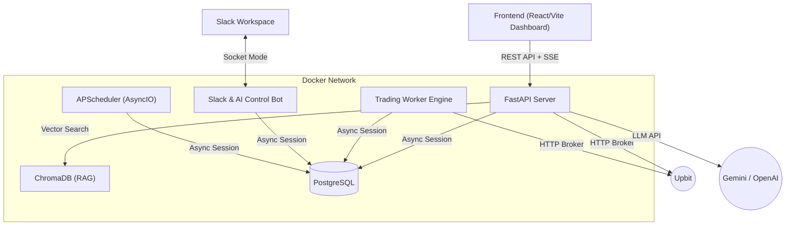
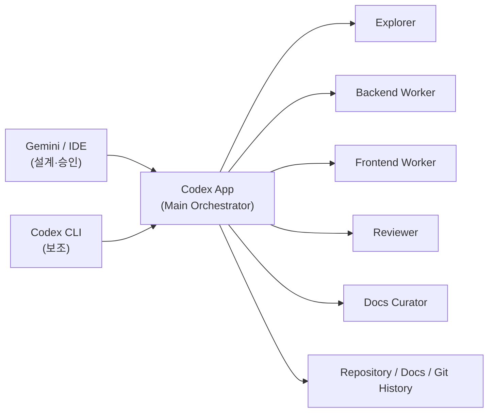
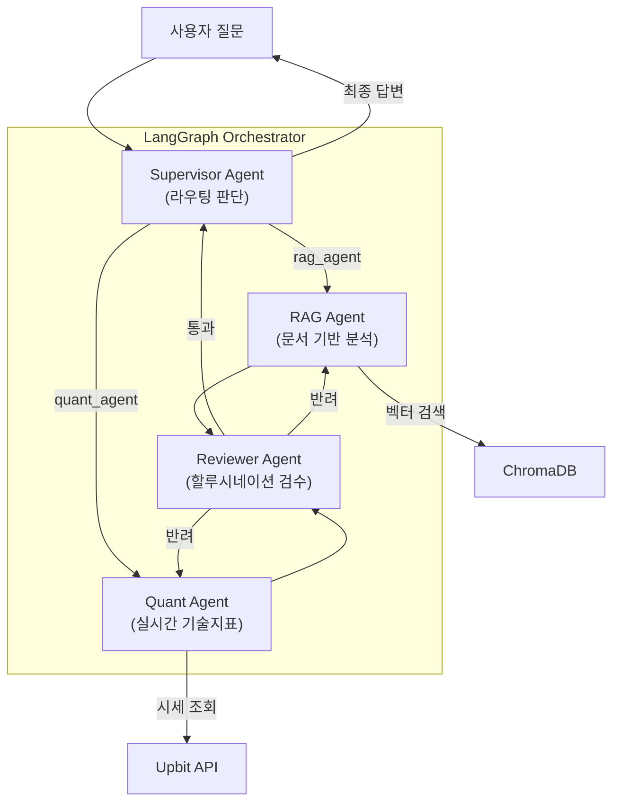

# AI-Trade-Manager 아키텍처 명세서 (Architecture Specification)

본 설계 문서는 **AI-Trade-Manager** 프로젝트의 시스템 구조와 기술 스택 선택의 의도를 설명합니다.
모든 개발(특히 Codex)은 이 문서를 최우선 기준으로 삼아 구조적 일관성을 유지해야 합니다.

> **최종 갱신 기준:** Phase 41 (AI Portfolio Dashboard) 완료

---

## 1. 핵심 철학 (Core Philosophy)
1. **관심사의 완벽한 분리 (Decoupling):** 백엔드(FastAPI)는 오직 JSON 데이터만 서빙하며, 모든 UI 렌더링은 프론트엔드(React)가 전담합니다.
2. **비동기 최우선 (Async-First):** 네트워크 병목 현상(거래소 API 호출)과 DB I/O가 잦은 트레이딩 봇의 특성을 고려하여 모든 I/O 작업은 `async/await` 구조를 따릅니다.
3. **무중단 운영 (Fault Tolerance):** 거래소 API에 장애가 생겨도 워커나 슬랙 봇이 멈추지 않도록 마이크로서비스 관점으로 컴포넌트를 분리합니다.
4. **AI-First 설계:** LLM 기반 멀티에이전트 오케스트레이션을 통해 자율 매매 판단, 시장 분석, 포트폴리오 관리를 지능적으로 수행합니다.

## 2. 시스템 아키텍처 (System Architecture)
애플리케이션은 **Docker Compose**를 기반으로 격리된 컨테이너 레이어 및 프론트엔드 클라이언트로 동작합니다.



### 2.1. 독립된 프로세스 레이어
1. **API Server Container (`app/api/`)**
   - 역할: REST 엔드포인트 제공. 프론트엔드 대시보드, 채팅, 백테스팅, 포트폴리오 관리 등 전반적인 기능 처리.
   - 특징: 트레이딩 자체는 수행하지 않는 "명령 하달 및 데이터 제공 인터페이스" 역할.
2. **Trading Worker Container (`app/services/trading/`)**
   - 역할: 24시간 백그라운드에서 주기적(Tick)으로 가격을 감시하고 조건 매매를 수행. AI 포트폴리오 매니저와 연동되어 지능적으로 동작.
   - 특징: API 서버 가동 여부와 무관하게 독자적인 DB 세션을 가지고 루프(Loop)를 돕니다.
3. **Messenger Bot Container (`app/services/slack_socket.py`)**
   - 역할: 사용자가 모바일에서 슬랙으로 내리는 명령어(`/잔고`, `긴급정지`, `/추천`)를 실시간으로 받아 DB/거래소에 반영하고, AI 에이전트를 통해 시장 분석 리포트를 제공.
4. **Scheduler (`app/core/scheduler.py`)**
   - 역할: `AsyncIOScheduler`(APScheduler)로 뉴스 수집, 시장 감성 분석, AI 자율분석, 포트폴리오 스냅샷 저장 등 주기적 잡을 관리.
   - 주요 잡: 뉴스 수집(4h), 시장 감성 갱신(5m), AI 자율분석(관심종목 순회), 포트폴리오 스냅샷(매시 정각)

### 2.2. 개발 운영 아키텍처 (AI Delivery Workflow)
런타임 멀티에이전트와 별개로, 개발 과정은 **Gemini / IDE 설계 + Codex 앱 적응형 멀티 에이전트 실행** 구조를 사용합니다.



- **Gemini / IDE:** 기능 설계, 범위 확정, 수용 기준 작성, 코어 아키텍처/DB/외부 계약 변경 승인
- **Codex 앱:** 현재 리포지토리와의 Delta 판정, 작업 분해, 병렬 조사/구현, 통합, 검증, 커밋 수행
- **Codex CLI:** 좁은 단일 확인이나 반복 명령이 필요할 때만 쓰는 보조 채널
- **Main Orchestrator:** 항상 존재하며 최종 통합과 커밋의 유일한 주체
- **Explorer / Worker / Reviewer / Docs Curator:** 작업 크기와 포트폴리오 가치에 따라 선택적으로 활성화

작업 크기별 기본 토폴로지는 아래와 같습니다.
- **작은 작업:** `Main` 단독
- **표준 작업:** `Main + Explorer + Worker 1명 + Reviewer`
- **크로스스택/포트폴리오 시그널이 큰 작업:** `Main + Explorer + Backend Worker + Frontend Worker + Reviewer`
- **문서/설명 가치가 큰 작업:** 위 조합 + `Docs Curator`

## 3. AI 멀티에이전트 아키텍처 (Phase 36~40)



### 3.1. 에이전트 구성
- **Supervisor:** 사용자 질문을 분류하여 적절한 전문 에이전트로 라우팅. 최종 답변 종합.
- **RAG Agent:** ChromaDB 벡터 DB에서 과거 뉴스/분석 문서를 검색하여 근거 기반 답변 작성.
- **Quant Agent:** 실시간 시세, 기술지표(RSI, MACD, BB), 호가, 체결 내역을 분석하는 도구(Tool) 보유.
- **Reviewer Agent (Phase 40):** RAG/Quant의 답변을 검수. 할루시네이션 검출 + 투자 면책 조항 강제. 최대 2회 재작업 지시(순환형 Self-Correction Loop).

### 3.2. SSE 스트리밍
- AI 채팅은 **Server-Sent Events(SSE)** 방식으로 실시간 스트리밍.
- 이벤트 타입: `agent_start`, `tool_start`, `tool_end`, `agent_end`, `final_answer`
- 프론트엔드에서 Activity Card(에이전트별 작업 상태)를 실시간 표시.

## 4. 백엔드 디렉토리 구조 (Directory Structure)

```text
ai-trade-manager/
├── app/
│   ├── api/              # 라우터 및 엔드포인트 정의 (표현 계층)
│   │   └── routes/       # 개별 엔드포인트 파일 (dashboard, chat, ai, portfolio 등)
│   ├── core/             # 프로젝트 전역 설정 (Config, Logging, Scheduler)
│   ├── db/               # 비동기 세션, 커넥션 풀, Repository 함수
│   ├── models/           # SQLAlchemy 2.0 도메인 ORM 모델 및 Pydantic 스키마
│   └── services/         # 실제 비즈니스 로직 (Service Layer)
│       ├── ai/           # LLM 연동 분석기 (OpenAI/Gemini)
│       ├── backtesting/  # 과거 데이터 기반 시뮬레이션 엔진
│       ├── brokers/      # 거래소 통신 클라이언트 (Upbit)
│       ├── chat/         # LangGraph 멀티에이전트 오케스트레이터
│       ├── indicators/   # MA, BB, RSI 등 기술적 지표 계산
│       ├── market/       # 시장 감성 분석 (Fear & Greed Index)
│       ├── portfolio/    # 자산 집계 서비스
│       ├── rag/          # RAG 벡터 DB 수집/검색 파이프라인
│       └── trading/      # 매매 엔진, AI 분석가, 정확도 검증 워커
├── docs/                 # 핵심 문서 아카이브
├── frontend/             # React/Vite 기반 대시보드 UI
├── migrations/           # Alembic DB 마이그레이션 스크립트
└── docker-compose-dev.yml
```

## 5. 프론트엔드 (Frontend) 구성
**React 18 + Vite + TypeScript** 기반으로 개발되었으며, `Recharts`와 `lightweight-charts`를 이용해 다양한 차트를 구현합니다.

- **대시보드 (Dashboard):** 실시간 시세 캔들 차트, 포트폴리오 도넛 차트, 시장 심리/뉴스 패널, AI 인사이트 브리핑, 봇 제어 패널, 최근 체결 내역.
- **AI 뱅커 (Chat):** LangGraph 멀티에이전트와 SSE 실시간 대화. Activity Card로 에이전트 작업 상태를 시각화하고, 세션 목록에서 대화 세션을 즉시 삭제할 수 있습니다.
- **연구소 (Laboratory):** 백테스트 엔진과 연동하여 전략 파라미터를 시뮬레이션하고, 차트 위에 타점(Buy/Sell Marker)을 시각화.
- **설정 (Settings):** 전략, 리스크, 스케줄, 그리드 매매 파라미터를 실시간 조정.
- **포트폴리오 (완료, Phase 41):** AI 기반 자산 관리 대시보드.

## 6. 거래소 추상화 (Broker Abstraction) 전략
어댑터 패턴(Adapter Pattern)을 사용하여 모든 거래소 클라이언트는 반드시 `BaseBrokerClient` 인터페이스를 상속합니다. `BrokerFactory`를 통해 동작하여, 단일 코드베이스로 다수 거래소를 원활하게 지원합니다.
## Phase 42 업데이트
- AI 채팅 세션 메타데이터를 `chat_sessions` 테이블로 분리하고, 각 세션에 `surface`(`ai_banker` 또는 `portfolio`)를 부여했습니다.
- AI 뱅커 메인 화면은 `ai_banker` 세션만 생성·조회합니다.
- 포트폴리오 자동 브리핑과 포트폴리오 미니챗은 `portfolio` 세션을 공유하지만, AI 뱅커 세션 목록에는 노출되지 않습니다.
- `ai_chat_messages`는 계속 메시지 본문을 저장하되, 모든 메시지는 `chat_sessions.session_id`를 부모로 참조합니다.
