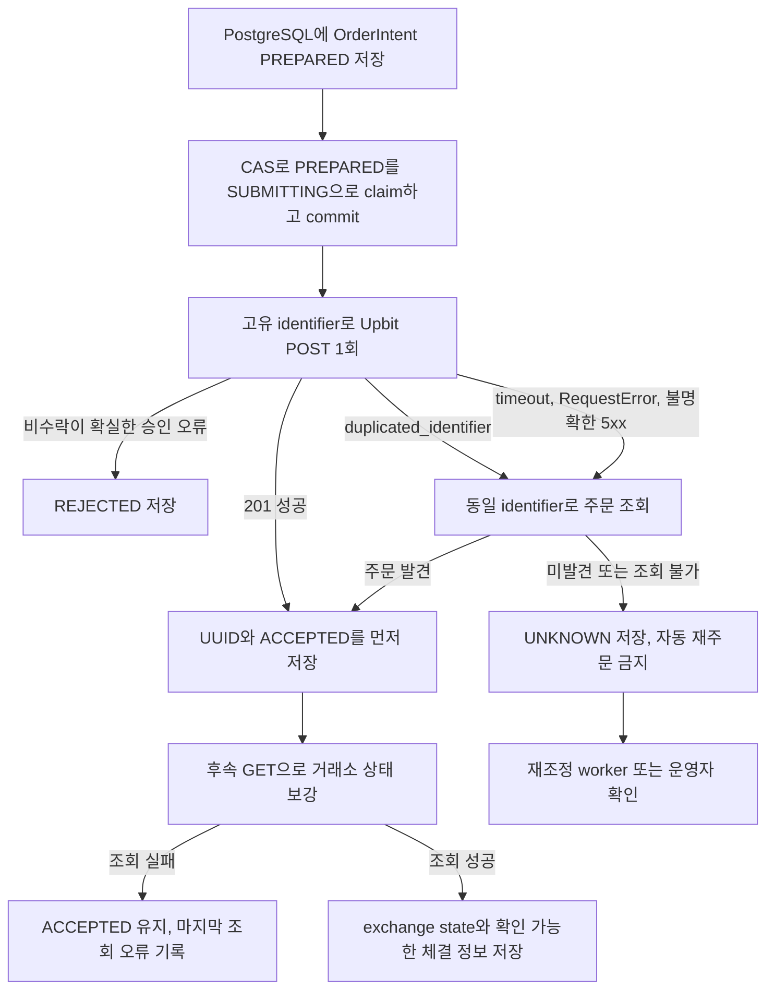

# P0-001 Upbit 주문 멱등성 강화 계획

> 발견사항: `ATM-P0-001`
> 상태: 코드 구현 및 로컬 PostgreSQL 16.12 최종 검증 완료 / 원격 CI 미실행
> 구현 상태: 로컬 단위·아키텍처·프론트·PostgreSQL 통합 검증 완료
> 결정 주체: 사용자와 Codex
> 실행 주체: Codex
> 원본 리뷰: [2026-07-10 프로젝트 안전성 리뷰](../reviews/2026-07-10-project-safety-review.md)

## 1. 문제 정의

하나의 논리적 주문 의도는 거래소 주문을 최대 한 건만 생성해야 합니다. 네트워크 타임아웃이나
응답 유실은 동일 주문을 다시 제출할 근거가 아니며, 불확실한 주문은 거래소 조회와 DB 조정을 통해
확정해야 합니다.

기준 커밋의 `UpbitBroker.create_order()`는 타임아웃 발생 시 총 5회 시도하며, 활성 실거래 호출부는
`identifier`를 전달하지 않습니다. 거래소가 주문을 접수한 뒤 응답만 유실하면 최초 요청 이후
최대 4회의 재시도로 동일 시장가 주문이 중복 접수될 수 있습니다.

## 2. 목표 불변조건

1. 동일한 주문 의도는 항상 동일한 DB 레코드와 identifier를 사용합니다.
2. 거래소 주문 POST는 주문 의도당 최대 한 번만 수행합니다.
3. POST 결과가 불확실하면 identifier 조회로 확인하고 자동 재주문하지 않습니다.
4. 프로세스가 재시작되어도 `SUBMITTING` 또는 `UNKNOWN` 주문을 PostgreSQL에서 복구할 수 있습니다.
5. 활성 실거래 호출부는 모두 공통 주문 실행 서비스를 통과합니다.
6. 거래소 상태와 내부 상태의 차이는 숨기지 않고 운영자에게 노출합니다.

## 3. 기준 커밋의 구현과 Delta

| 영역 | 현재 구현 | 남은 Delta |
|---|---|---|
| 브로커 주문 | `BaseBrokerClient.create_order()`가 `identifier` 인자를 가짐 | 활성 호출부가 값을 전달하지 않음 |
| Upbit 조회 | `UpbitBroker.get_order(uuid_, identifier)` 지원 | `BaseBrokerClient` 계약에 단건 조회가 없음 |
| 재시도 | `create_order()`가 timeout 시 총 5회 시도 | 불확실 결과를 새 POST가 아닌 조회로 전환 |
| 주문 저장 | 주문 응답 처리 후 요청값 fallback을 허용해 `OrderHistory` 생성 | 제출 전 주문 의도와 UNKNOWN 상태를 저장할 수 없음 |
| 거래소 키 | 응답 UUID만 일시 사용 | identifier와 exchange UUID를 DB에서 추적하지 않음 |
| 체결 확정 | 주문 직후 단건 조회 1회 | 부분·미체결과 재시작 조정 흐름이 없음 |
| 동시성 | 호출부별 직접 주문 | 동일 intent의 동시 제출을 막는 DB 제약·잠금이 없음 |

### Upbit 고정 계약

아래 항목은 설계 선택지가 아니라 Upbit API가 요구하는 고정 제약입니다.

- identifier는 사용자 계정 전체 주문에서 고유해야 합니다.
- 한 번 사용한 identifier는 주문 생성·체결 여부와 관계없이 다시 사용할 수 없습니다.
- identifier의 최대 길이는 64자입니다.
- 단일 주문은 UUID 또는 identifier 중 하나로 조회할 수 있습니다.

근거: [주문 생성](https://docs.upbit.com/kr/reference/new-order),
[개별 주문 조회](https://docs.upbit.com/kr/reference/get-order). 확인일: 2026-07-10.

### 활성 실거래 호출부

1. `app/services/trading/ai_executor.py:718` — `execute_hard_tp_sl_check()` 하드 TP/SL 시장가 매도
2. `app/services/trading/ai_executor.py:1192` — `_execute_buy_trade()` AI 시장가 매수
3. `app/services/trading/ai_executor.py:1344` — `_execute_sell_trade()` AI 시장가 매도
4. `app/api/routes/status.py:68` — `liquidate_all_endpoint()` REST 비상 전량 청산

자동 스케줄러와 수동 AI Cycle은 같은 AI 실행 함수를 호출하므로 호출 시점에 UUID를 새로 만드는
것만으로는 부족합니다. 분석 로그, 실행 종류, 심볼 등 안정적인 업무 키에서 DB 주문 의도를 한 번만
만들어야 합니다.

### 외부 주문 기능 범위에서 제외할 경로

- `app/services/backtesting/engine.py`의 주문은 `SimulatedBroker` 전용이므로 제외합니다.
- AI paper 거래는 외부 주문을 호출하지 않으므로 제외합니다.
- `KoreaInvestmentBroker`는 미구현 스텁이고 활성 호출부가 없어 제외합니다.

### 휴면 코드의 구조적 처리

- `app/services/slack_socket.py`의 직접 실주문 코드는 현재 앱에서 시작되지 않는 휴면 레거시입니다.
  사용자 기능 동작은 1차 범위에서 제외하되, 직접 `create_order()` 호출은 이번 작업에서 제거하거나
  공통 주문 서비스로 이관해 미래 재활성화 시 우회 경로가 되지 않게 합니다.

## 4. 확정 설계

아래 내용은 사용자가 확정한 ATM-P0-001 구현 기준입니다.

### 4.1 별도 OrderIntent 모델

기존 `OrderHistory`는 `position_id`, 체결 가격, 체결 수량이 필수인 체결 이력입니다. 제출 전 상태를
표현하도록 의미를 바꾸지 않고 별도의 `OrderIntent` 테이블을 추가합니다.

최소 후보 필드:

- 내부 PK
- 계정 범위 고유 `identifier`
- 업무 중복 방지용 `intent_key` unique
- symbol, side, order type
- 요청 금액 또는 요청 수량을 위한 `Numeric/Decimal` 필드
- 애플리케이션 제출 상태와 거래소 주문 상태
- exchange UUID nullable/unique
- AI 분석 로그 또는 청산 작업 참조 nullable
- 오류 코드와 안전하게 축약한 오류 메시지
- created/submitted/last_checked/resolved timestamps
- 낙관적 잠금용 version 또는 동등한 동시성 제어 필드
- 정리 이후에도 identifier 재사용을 막는 tombstone 또는 영구 보존 정책

이번 범위는 at-most-once 주문 제출, 거래소 접수 상태 원장, 종결 시 누적 체결의 정확히 한 번
투영까지 포함합니다. `OrderHistory`는 실제 체결 이력 의미를 유지하며 UNKNOWN·미체결 주문을 요청
수량 전체 체결로 확정하지 않습니다. 부분체결 이벤트별 실시간 원장은 후속 범위로 분리합니다.

### 4.2 상태 후보

제출 과정과 거래소 체결 상태를 한 필드에 섞지 않는 방식을 권장합니다.

애플리케이션 제출 상태:

- `PREPARED`: DB에 의도를 저장했지만 POST를 시작하지 않음
- `SUBMITTING`: 조건부 claim을 완료해 POST가 실행됐거나 실행됐을 가능성이 있으며 결과를 아직
  확정하지 못함
- `ACCEPTED`: 거래소 주문 UUID 또는 identifier 조회로 접수를 확인함
- `REJECTED`: 거래소가 명시적으로 거부
- `UNKNOWN`: timeout 또는 조회 장애로 접수 여부를 확정할 수 없음
- `ABANDONED`: 제출되지 않은 오래된 PREPARED intent를 운영 정책에 따라 종료

거래소 상태는 Upbit 응답의 `wait`, `watch`, `done`, `cancel` 값을 별도로 보존하고, 누적 체결량과
잔여 수량도 분리합니다. `ACCEPTED`는 체결 완료가 아니라 거래소 접수 확인을 뜻합니다.

상태 전이는 repository/service에서만 수행하고 API나 개별 실행기는 직접 상태 문자열을 쓰지
않도록 합니다.

### 4.3 제출·복구 흐름

201 응답으로 접수를 확인한 주문은 후속 GET 실패 때문에 UNKNOWN으로 되돌리지 않습니다. UNKNOWN은
POST 자체의 접수 여부가 불명확할 때만 사용합니다.

### 4.4 공통 주문 실행 서비스

`LiveOrderExecutionService`가 다음 책임을 갖습니다.

- 주문 의도 생성 또는 기존 intent 조회
- DB unique 제약과 `PREPARED → SUBMITTING` 조건부 UPDATE/CAS를 이용한 원자적 실행자 claim
- claim에 성공한 실행자 한 명만 POST하고 나머지는 현재 상태 조회 또는 reconciliation 수행
- 저장·잠금이 완료된 OrderIntent에서만 identifier를 읽고 호출자 임의 identifier 제출 차단
- identifier를 포함한 단 한 번의 주문 제출
- blank identifier를 네트워크 호출 전에 거부하는 fail-closed 브로커 경계
- timeout 시 identifier 조회
- `duplicated_identifier` 응답을 새 주문 실패가 아니라 기존 주문 조회 신호로 처리
- identifier 조회를 실행한 broker/account 컨텍스트와 응답의 market, side, order type, 요청값을
  저장된 intent와 대조
- 거래소 응답 정규화와 상태 전이
- 확인되지 않은 주문을 체결로 확정하지 않도록 기존 OrderHistory/Position 반영 경로 제어
- UNKNOWN/실패 로그와 운영 알림

외부 API 호출 중에는 DB row lock을 유지하지 않습니다. 미확정 매수는 모든 신규 매수와 동일 마켓
주문을 차단하고, 미확정 매도는 동일 마켓 주문을 차단합니다. PostgreSQL partial unique index와
서비스 선행 조회를 함께 사용합니다.

이 서비스가 이후 `ATM-P0-002` kill switch를 모든 실주문에 적용하는 단일 경계가 됩니다. 다만
이번 작업에서는 멱등성과 불확실 주문 복구에 집중하고 kill switch의 상세 정책은 별도 후속
항목으로 유지합니다.

### 4.5 오류 분류 기준안

| 분류 | 예시 | 처리 기준안 |
|---|---|---|
| 비수락이 확실한 오류 | 검증·잔고·최소금액·인증·권한·418·429 | REJECTED, 재POST 금지 |
| 기존 주문 조회가 필요한 오류 | `duplicated_identifier` | 동일 identifier 조회, 새 identifier 생성 금지 |
| 수락 여부가 불확실한 결과 | timeout, connection reset, 응답 파싱 실패, 5xx | identifier 조회 후 미확정이면 UNKNOWN, 재POST 금지 |
| 미분류 오류 | 승인된 분류표에 없는 오류 | UNKNOWN으로 fail-closed, 재POST 금지 |

인증·권한·418 오류는 `live_order_v2_enabled`도 끕니다. 어떤 미분류 오류도 자동 재POST로
이어지지 않고 UNKNOWN으로 차단합니다.

## 5. 확정 결정

1. 별도 `OrderIntent` 원장을 신설하고 `OrderHistory` 의미를 유지합니다.
2. 부분체결 실시간 원장은 제외하되 `done/cancel` 종결 누적 체결을 정확히 한 번 투영합니다.
3. AI는 분석 로그 ID, 청산은 operation ID와 market, TP/SL은 처리 중 intent 또는 새 이벤트 키를 사용합니다.
4. identifier는 32자 UUID4 hex를 영구 보존합니다.
5. `BaseBrokerClient`에 identifier 기반 `get_order()` capability를 둡니다.
6. 중앙 서비스와 repository가 독립 `AsyncSession`의 짧은 트랜잭션 경계를 소유합니다.
7. partial unique index, version CAS, PostgreSQL lease를 함께 사용합니다.
8. UNKNOWN은 자동 만료하지 않으며 엄격한 관리자 확인 절차로만 종결합니다.
9. 미확정 매수는 신규 매수 전역과 동일 마켓, 미확정 매도는 동일 마켓을 차단합니다.
10. REST 전량청산은 UUID v4 `Idempotency-Key`와 종목별 intent를 사용합니다.
11. 휴면 `slack_socket.py`는 제거하고 현재 `SlackBot` 알림만 유지합니다.
12. `live_order_v2_enabled=false`로 배포하고 reconciliation은 플래그와 무관하게 계속 실행합니다.

## 6. 구현 순서

### Task 1 — 모델과 Alembic

- 확정된 주문 의도 모델과 제약·인덱스를 추가합니다.
- Alembic migration을 생성하고 upgrade/downgrade 및 빈 DB 적용을 검증합니다.
- 신규 주문 원장의 금융 값은 `Numeric/Decimal`로 저장합니다.

### Task 2 — repository와 상태 전이

- intent 생성·조회·잠금·상태 전이 repository를 SQLAlchemy 2.0 async로 구현합니다.
- 중복 생성과 lost update를 DB 제약으로 차단합니다.
- `UPDATE ... WHERE status = PREPARED` 또는 동등한 CAS로 한 실행자만 SUBMITTING을 claim하게 합니다.
- claim 실패 실행자는 POST하지 않고 저장된 상태를 반환하거나 reconciliation만 수행합니다.
- 외부 API 호출 동안 DB 트랜잭션을 장시간 유지하지 않도록 짧은 트랜잭션 경계를 설계합니다.
- 호출자의 세션을 임의 commit해 AI 분석 등 관련 없는 변경을 함께 반영하지 않도록 합니다.

### Task 3 — 브로커 계약

- identifier 기반 단건 주문 조회를 공통 계약에 반영합니다.
- Upbit 구현과 fake broker를 같은 응답 모델로 정규화합니다.
- `create_order()`의 자동 timeout POST 재시도를 제거합니다.
- timeout, `httpx.RequestError`, 응답 파싱 실패, 429, 불명확한 5xx는 UNKNOWN 후보로 처리하고
  identifier GET만 재시도합니다.
- `duplicated_identifier`는 일반 4xx REJECTED 규칙의 예외로 두고 기존 주문을 조회합니다.
- 일반 조회 재시도와 주문 제출 재시도 정책을 분리합니다.

### Task 4 — 공통 주문 실행 서비스

- DB intent, 1회 POST, identifier 조회와 접수 상태 전이를 한 서비스로 통합합니다.
- 민감 응답과 토큰을 로그에 남기지 않고 identifier, 상태, 오류 코드만 구조적으로 남깁니다.
- UNKNOWN 주문을 재조회하는 재조정 진입점을 구현합니다.
- SUBMITTING/UNKNOWN과 충돌하는 새 intent의 제출을 승인된 범위에서 fail-closed 처리합니다.

### Task 5 — 활성 호출부 전환

- 하드 TP/SL 매도
- AI 시장가 매수
- AI 시장가 매도
- REST 전량 청산의 종목별 주문

직접 `broker.create_order()` 호출을 제거하고 공통 서비스를 사용합니다. 백테스트와 paper 경로가
영향받지 않는지 확인합니다.

휴면 `slack_socket.py`의 직접 실주문 호출도 제거하거나 공통 서비스로 이관합니다. 현재 실행되지
않는다는 이유로 아키텍처 테스트 allowlist에 남기지 않습니다.

### Task 6 — 운영 관측성과 복구

- PREPARED/SUBMITTING/UNKNOWN 장기 체류를 상태 API와 로그에서 확인할 수 있게 합니다.
- 재시작 시 미확정 intent를 조회하는 복구 경로를 추가합니다.
- UNKNOWN 상태에서는 자동 재주문하지 않고 명시적 운영 절차를 제공합니다.
- UNKNOWN은 성공으로 알리지 않고 identifier, 경과 시간, 마지막 조회 오류를 상태 API에 노출합니다.

### Task 7 — 테스트와 문서

- 아래 테스트 매트릭스를 구현합니다.
- AST 기반 아키텍처 테스트로 공통 서비스와 명시적인 SimulatedBroker 경로 외의
  `.create_order()` 직접 호출을 차단합니다.
- `README.md`, `docs/ARCHITECTURE.md`, `docs/DATABASE.md`, `docs/OPERATIONS.md`를 실제 구현과
  함께 갱신합니다.
- 이 계획 문서에는 결정, 커밋, migration revision, 검증 결과를 기록합니다.

## 7. 테스트 매트릭스

| 시나리오 | 기대 결과 |
|---|---|
| 주문 접수 전 연결 timeout | POST 재전송 없음, intent UNKNOWN, 후속 조회 가능 |
| 거래소 접수 후 응답 timeout | identifier 조회로 기존 주문 1건 발견, 중복 POST 없음 |
| identifier 조회가 일시 실패 | bounded 조회 후 UNKNOWN, 자동 재주문 없음 |
| `duplicated_identifier` 응답 | 같은 identifier 조회 후 기존 주문과 요청값 대조, 새 identifier 생성 금지 |
| 201 성공 후 후속 GET 실패 | ACCEPTED와 UUID 유지, 마지막 조회 오류만 갱신 |
| 비수락이 확실하다고 승인된 오류 | REJECTED, 자동 재시도 없음 |
| 미분류 오류 | UNKNOWN, 자동 재POST 없음 |
| 미확정 주문이 없을 때 서로 다른 두 intent | 서로 다른 identifier와 독립 주문 |
| 같은 intent 동시 실행 | CAS claim 성공자만 POST, 거래소 주문 최대 1회 |
| SUBMITTING commit 직후 POST 전 프로세스 종료 | 재시작 조회 후 UNKNOWN, 자동 POST 금지 |
| POST 직후 프로세스 종료 | 재시작 후 SUBMITTING/UNKNOWN reconciliation |
| 거래소 성공 후 DB 기록 실패 | 재시작 조정으로 exchange UUID와 상태 복구 |
| 동일 intent를 여러 worker가 동시 reconciliation | 상태 반영 멱등, OrderHistory/Position 중복 반영 없음 |
| 동일 거래소 주문을 반복 reconciliation | 접수 상태와 내부 반영 결과가 중복되지 않음 |
| 조회 주문의 market/side/type/request 값 불일치 | 기존 intent와 연결 금지, UNKNOWN 유지와 치명 경보 |
| 부분체결 또는 체결량 0 | 요청 수량 전체를 OrderHistory 체결로 확정하지 않음 |
| UNKNOWN 중 충돌하는 새 intent | 승인된 계정/마켓 차단 범위에서 POST되지 않음 |
| 오래된 주문 레코드 정리 후 동일 identifier 생성 시도 | 영구 미재사용 제약으로 거부 |
| 하드 TP/SL·AI BUY·AI SELL | 모든 경로가 공통 서비스와 identifier 사용 |
| 전량 청산 여러 자산 | 자산별 고유 intent, 부분 실패 결과 보존 |
| blank identifier | Upbit 네트워크 호출 전에 fail-closed |
| 신규 직접 `create_order()` 호출 | 아키텍처 테스트 실패 |
| backtest·paper | 기존 동작과 결과 불변 |

PostgreSQL unique 제약, row lock, migration은 SQLite mock이 아닌 실제 PostgreSQL 통합 테스트로
검증해야 합니다. fake Upbit broker는 `접수 후 timeout`, `조회 지연`, `부분체결`을 결정적으로
재현할 수 있어야 합니다.

## 8. 수용 기준

- [x] fault injection 상황에서도 같은 주문 의도로 생성된 거래소 주문은 최대 1건이다.
- [x] 수락 여부가 불확실하거나 미분류인 결과 이후 `create_order()`가 두 번째 POST를 수행하지 않는다.
- [x] 활성 실거래 호출부 네 곳이 모두 공통 주문 서비스를 사용한다.
- [x] 모든 실주문에 non-empty identifier가 전달된다.
- [x] identifier는 64자 이하이며 계정 전체에서 영구 재사용되지 않는다.
- [x] `UpbitBroker.create_order()`는 blank identifier를 네트워크 호출 전에 거부한다.
- [x] 공통 서비스는 저장·잠금된 OrderIntent의 identifier만 사용하고 호출자 임의 값 제출을 허용하지 않는다.
- [x] 휴면 Slack을 포함한 live 직접 `create_order()` 호출이 남아 있지 않다.
- [x] AST 아키텍처 테스트가 공통 서비스와 명시적 시뮬레이션 경로 외의 우회 호출을 차단한다.
- [x] 해당 아키텍처 테스트가 CI 필수 게이트에 포함된다.
- [x] 동일 intent 동시 호출은 DB unique 제약과 원자적 CAS claim으로 한 번만 제출된다.
- [x] 재시작 후 SUBMITTING/UNKNOWN 주문을 DB에서 발견하고 거래소 상태를 조회할 수 있다.
- [x] 201 성공 후 후속 GET 실패는 ACCEPTED 상태와 exchange UUID를 보존한다.
- [x] SUBMITTING/UNKNOWN 중 충돌하는 새 intent가 확정된 차단 범위에서 POST되지 않는다.
- [x] 조회 결과의 핵심 요청값이 intent와 다르면 연결하지 않고 치명 로그와 Slack 경보를 남긴다.
- [x] 요청값, identifier, exchange UUID, 제출 상태와 거래소 상태를 PostgreSQL에서 추적할 수 있다.
- [x] UNKNOWN이나 확인되지 않은 부분·미체결을 요청 수량 전체 체결로 확정하지 않는다.
- [x] 여러 reconciliation worker와 반복 조회가 상태·OrderHistory·Position을 중복 반영하지 않는다.
- [x] UNKNOWN은 성공으로 알리지 않고 identifier, 경과 시간, 마지막 조회 오류를 상태 API에 노출한다.
- [x] 전체 기존·신규 회귀 및 PostgreSQL 통합 테스트가 통과한다.
- [x] Ruff, Alembic single head/check, 관련 API 테스트가 통과한다.
- [x] ARCHITECTURE, DATABASE, OPERATIONS, README가 구현과 동기화된다.
- [x] 실제 PostgreSQL 검증 전 상태를 최종 완료로 과장하지 않는다.

2026-07-13 로컬 PostgreSQL 16.12에서 PostgreSQL marker 64개를 migration 왕복 전후 두 차례 모두
통과했습니다. 동일 intent 8세션, 동시 종결 투영, 청산 operation 동시 재요청, terminal 상태 불변,
`alembic downgrade d3a9f7c1b2e4` 후 재업그레이드, `alembic check`와 단일 head를 확인했습니다.
원격 CI는 실행하지 않았습니다.

## 9. 롤아웃과 임시 운영 제한

구현과 fault-injection 검증이 끝날 때까지 paper 모드와 inactive 봇을 운영 기본으로 유지하는 것을
권장합니다. 실제 키를 사용하는 환경에서는 주문 권한을 비활성화하거나 별도 안전 조치를 적용할지
운영자가 결정해야 합니다.

권장 rollout:

1. additive migration 적용
2. fake Upbit와 fault-injection 환경에서 주문 intent와 복구 흐름 검증
3. 장애 주입 및 동시성 테스트
4. live 주문 권한 없이 shadow 관측
5. 운영자 승인 후 제한된 live 검증
6. SUBMITTING/UNKNOWN 경보와 reconciliation 확인 후 확대

코드 롤백 시에도 이미 제출된 UNKNOWN 주문은 사라지지 않아야 하므로 DB migration을 즉시
downgrade하지 않고 먼저 거래소와 상태를 조정합니다.

## 10. 의미 단위 커밋 계획

1. `feat(db): 주문 의도와 식별자 추적 모델 추가`
2. `refactor(broker): 식별자 기반 주문 조회 계약 표준화`
3. `feat(trading): 멱등 주문 실행 서비스 도입`
4. `refactor(trading): 활성 실거래 주문 경로 통합`
5. `test(trading): 타임아웃 중복 주문 방지 회귀 검증`
6. `docs(safety): 주문 멱등성과 복구 절차 동기화`

커밋 제목은 실제 변경 범위에 맞춰 조정하며 모델, migration, repository, service, 호출부,
테스트, 문서를 가능한 한 분리합니다.

## 11. 운영 의사결정 원칙

이 프로젝트는 별도 AI 설계 승인 단계를 사용하지 않습니다. 사용자 요청과 이 문서의 확정 범위를
실행 계약으로 삼고, Codex가 Delta 판정, 구현, 검토, 검증, 문서 동기화를 수행합니다. 구현 중
치명적인 계약 충돌이 발견될 때만 근거와 선택지를 사용자에게 다시 제시합니다.

## 12. 결정 및 구현 이력

구현 커밋:

- `6799bf9` — 주문 의도 원장과 청산 작업 스키마
- `d79c0a1` — 멱등 실주문 실행 경계
- `f6db1d2` — 실주문 호출부와 청산 복구 API
- `7fe6f6a` — 프론트 청산·주문 상태 표시
- `fd5e64e` — 장애 복구 테스트와 PostgreSQL CI

| 날짜 | 상태 | 내용 |
|---|---|---|
| 2026-07-10 | 계획 작성 | 최초 실행 계획 작성 |
| 2026-07-10 | 사용자 범위 확정 | 별도 AI 승인 절차를 폐기하고 ATM-P0-001 구현 시작 |
| 2026-07-10 | 코드 구현 완료 | migration `e7b4c9a1d2f6`, 중앙 주문 서비스, API/UI, 복구 worker와 CI 추가 |
| 2026-07-10 | 로컬 검증 완료 | 172 passed, PostgreSQL 전용 7 skipped, Ruff·프론트 lint/test/build·offline migration 통과 |
| 2026-07-13 | 로컬 PostgreSQL 최종 검증 | PostgreSQL 16.12 marker 64 passed를 migration 왕복 전후 2회 통과, `alembic check`와 단일 head 확인; 원격 CI·push 미실행 |
