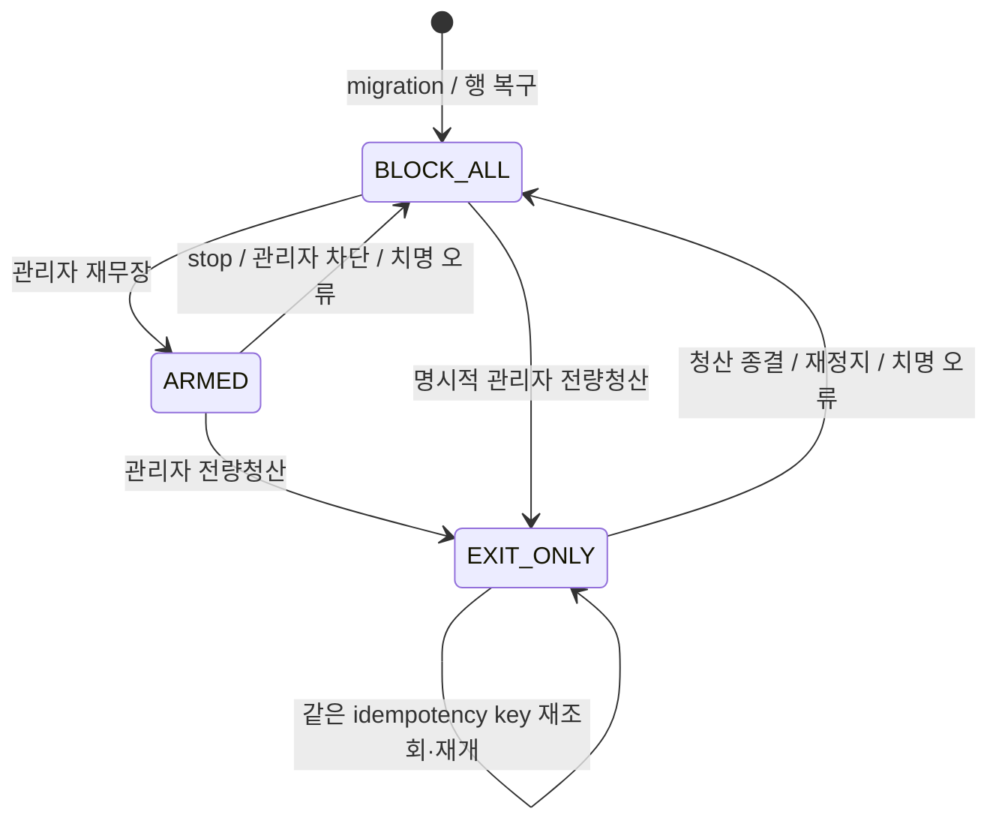

# P0-002 전역 실주문 Kill Switch 설계

> 역사적 청산 계약 안내: 이 문서는 P0-002 구현 당시의 범위 예외와 `LIQUIDATE_ALL` 계약을
> 보존합니다. 현재 계정 전체 청산 API·잔고·최종 성공 판정은 P0-004에서 대체됐으며,
> [P0-004 전량청산 증거 기반 종결 계획·구현 기록](p0-004-liquidation-proof.md)을 기준으로 운영합니다.
>
> 발견사항: `ATM-P0-002`
> 상태: 코드·로컬 회귀·PostgreSQL 16.12 최종 검증 완료 / 원격 CI 미실행
> 설계 기준 커밋: `37d2c81b8f64cc14b950a3803a85bd46576abc4a`
> 결정·실행 주체: 사용자와 Codex
> 원본 리뷰: [2026-07-10 프로젝트 안전성 리뷰](../reviews/2026-07-10-project-safety-review.md)

## 1. 목표와 확정 범위

다음 불변식을 PostgreSQL과 중앙 실주문 서비스에서 강제합니다.

1. `/api/bot/stop`이 성공 응답을 반환한 뒤부터 관리자의 새로운 `ARMED` 또는 `EXIT_ONLY` 전이가
   성공하기 전까지 새 Upbit `POST /v1/orders`가 시작되지 않습니다.
2. 모든 일반 실주문은 배포 기능 플래그, 봇 런타임, 전역 실주문 제어 상태를 모두 통과해야 합니다.
3. 봇 시작은 분석·스케줄러 런타임만 재개하며 실주문을 자동으로 재활성화하지 않습니다.
4. 전량청산은 명시적으로 승인된 하나의 `LiquidationOperation` 범위에서만 `EXIT_ONLY` 예외를 사용합니다.
5. 정지 상태에서도 이미 제출된 주문의 조회, reconciliation, 체결 투영은 계속합니다.
6. paper·backtest 동작은 변경하지 않습니다.

이번 범위는 **새 주문 POST 차단**입니다. 이미 거래소에 접수된 `wait/watch` 주문의 자동 취소,
포지션 강제 청산 정책, `balance/locked` 해석은 각각 기존 reconciliation과 `ATM-P0-004` 후속 범위로
유지합니다.

## 2. 구현 결과와 남은 검증 Delta

구현된 범위:

- 모든 활성 실주문 POST는 `LiveOrderExecutionService` 한 곳을 통과합니다.
- AI BUY/SELL과 하드 TP/SL은 `GENERAL`, REST 전량청산은 `EMERGENCY_EXIT`로 구분하며, 비상 권한은
  호출자 문자열이 아니라 PostgreSQL operation·스냅샷·감사 event로 검증합니다.
- `LiveOrderSubmissionBarrier`가 주문 준비와 최종 제출에 shared session lock, 정지·재무장·청산에
  exclusive session lock을 적용합니다.
- REST·Slack·Telegram 정지는 같은 `LiveOrderControlService`를 사용해 런타임 정지와 `BLOCK_ALL`을
  함께 적용합니다. 시작은 런타임만 재개합니다.
- 스케줄러는 런타임 정지 시 하드 TP/SL과 자율 AI 분석·집행을 건너뛰고, reconciliation은 계속합니다.
- `live_order_v2_enabled`는 일반 설정과 AI Banker 설정 승인에서 수정할 수 없는 보호 키입니다.
- 청산은 기존 일반 주문을 먼저 차단·drain하고 불변 대상 스냅샷을 만든 뒤 하나의 operation만
  `EXIT_ONLY`로 승인합니다. 종결 결과와 `CLOSED/BLOCK_ALL`은 같은 트랜잭션에 저장합니다.
- React는 런타임과 Gate를 분리 표시하고, 재무장·차단의 멱등 키 재시도, 서버 검증용
  `LIQUIDATE_ALL`, Gate 차단 중 분석-only 수동 AI Cycle을 반영합니다.

로컬 구현 Delta와 PostgreSQL 검증 Delta는 완료했습니다. 2026-07-13 격리된 PostgreSQL 16.12에서
migration·advisory lock 경합·submit 대 stop·영속 drain을 포함한 marker 64개를 migration 왕복 전후
두 차례 통과했습니다. 원격 GitHub Actions는 실행하지 않았으므로 원격 CI 상태는 별도로 남습니다.

`BotConfig.is_active`, `live_order_v2_enabled`, 전역 실주문 제어 원장은 다음처럼 서로 다른 책임으로
분리되어 있습니다.

| 제어 | 책임 | 자동 변경 |
|---|---|---|
| `BotConfig.is_active` | 분석·스케줄러 런타임 | start/stop |
| `live_order_v2_enabled` | 배포·인증 장애용 절대 기능 퓨즈 | 관리자 배포 절차, 치명적 거래소 오류 |
| `LiveOrderControl.mode` | 운영 중 신규 실주문 허용 범위 | 명시적 관리자 명령과 청산 종결 |

## 3. 상태 모델

### 3.1 제어 상태

`(broker=UPBIT, account_scope=primary)`당 `live_order_controls` 한 행을 둡니다.

- `ARMED`: 검증을 통과한 일반 실주문만 허용합니다. 전량청산은 먼저 `EXIT_ONLY`로 전이합니다.
- `EXIT_ONLY`: 행에 연결된 하나의 전량청산 operation만 허용합니다.
- `BLOCK_ALL`: 청산을 포함한 모든 신규 실주문 POST를 차단합니다.

행이 없거나 값을 해석할 수 없거나 DB 조회가 실패하면 `BLOCK_ALL`로 처리합니다.

| 기능 플래그 | 봇 실행 | 제어 상태 | `GENERAL` | 연결된 `EMERGENCY_EXIT` |
|---|---:|---|---:|---:|
| OFF | 무관 | 무관 | 차단 | 차단 |
| ON | false | `ARMED` | 차단 | 차단 |
| ON | true | `ARMED` | 허용 | 차단, 먼저 `EXIT_ONLY` 전이 |
| ON | 무관 | `EXIT_ONLY` | 차단 | 해당 operation만 허용 |
| ON | 무관 | `BLOCK_ALL` | 차단 | 차단 |

`EXIT_ONLY`의 허용 여부는 요청 문자열이 아니라 DB의 활성 청산 operation과 불변 스냅샷으로
검증합니다.

### 3.2 상태 전이

제약:

- `/bot/start`는 어떤 상태도 `ARMED`로 바꾸지 않습니다.
- `/bot/stop`은 현재 상태를 완화하지 않고 항상 `BLOCK_ALL`로 만듭니다.
- `BLOCK_ALL → EXIT_ONLY`는 `/bot/liquidate`의 관리자 인증, UUID v4 멱등 키, 명시적 전량청산
  확인을 모두 통과한 새 operation에만 허용합니다. 기능 플래그가 OFF이면 이 전이도 금지합니다.
- `EXIT_ONLY`에서 별도의 `/bot/stop`이 호출되면 operation 권한을 폐기하고 `BLOCK_ALL`로 갑니다.
- 폐기된 청산 operation의 같은 멱등 키 재요청은 게이트를 자동으로 다시 열지 않고 `409`를
  반환합니다. 새 청산 의도는 새 UUID와 새 확인이 필요합니다.
- 청산 operation이 종결되면 성공·부분 실패와 무관하게 `BLOCK_ALL`로 돌아갑니다.

## 4. 데이터 모델

### 4.1 `live_order_controls`

- `id`
- `broker`, `account_scope`; 두 열 unique
- `mode`: `ARMED`, `EXIT_ONLY`, `BLOCK_ALL`
- `active_liquidation_operation_id`: nullable FK
- `generation`: 주문 허용 범위가 바뀔 때마다 증가하는 정수
- `version`: repository CAS용 정수
- `reason_code`, `reason_text`
- `changed_source`: `REST`, `SLACK`, `TELEGRAM`, `SYSTEM`, `AUTH_FAILURE`
- `changed_actor_ref`: 현재 인증 체계에서 확인 가능한 인증 종류·Slack 사용자·Telegram 사용자 식별
- `armed_at`, `blocked_at`, `created_at`, `updated_at`

DB 제약:

- `generation >= 1`, `version >= 1`
- `mode = EXIT_ONLY`일 때만 `active_liquidation_operation_id IS NOT NULL`
- 그 외 상태에서는 `active_liquidation_operation_id IS NULL`
- hard delete 금지

mode, 활성 청산 operation, 기능 플래그처럼 주문 허용 결과를 바꾸는 전이는 generation을 증가시킵니다.
동일한 제한 상태를 다시 요청한 no-op은 감사할 수 있지만 generation을 증가시키지 않습니다.

### 4.2 `live_order_control_events`

append-only 감사 원장을 추가합니다.

- `id`, `control_id`, `generation`
- `request_id`: 제어 API의 UUID v4 멱등 키, nullable unique
- `request_fingerprint`: action, expected generation, 사유, 확인 문구의 정규화 해시
- `action`, `from_mode`, `to_mode`
- `reason_code`, `reason_text`
- `source`, `actor_ref`
- `liquidation_operation_id`
- `created_at`

애플리케이션은 event update/delete API를 제공하지 않습니다. `generation` 변경과 event 삽입은 같은
트랜잭션에서 처리합니다.

### 4.3 기존 모델 변경

`order_intents`에 제출 승인 시점의 감사 정보를 추가합니다.

- `prepared_control_generation`, `prepared_control_mode`
- `control_generation`
- `control_mode`
- `control_event_id`
- `submission_authorized_at`

`liquidation_operations`에는 다음을 추가합니다.

- `emergency_authorization_status`: `ACTIVE`, `REVOKED`, `CLOSED`
- `emergency_authorized_at`
- `emergency_control_generation`
- `emergency_control_event_id`
- `emergency_authorized_source`
- `emergency_revoked_at`, `emergency_revocation_reason`
- `emergency_closed_at`

동일 청산 operation의 종목별 intent는 같은 승인 generation을 사용합니다. 요청의 마켓·매도
방향·주문 유형·수량은 operation의 기존 불변 대상 스냅샷과 일치해야 합니다.

청산 operation은 먼저 `PREPARING/REVOKED(FAIL_CLOSED_NOT_AUTHORIZED)`로 생성합니다. 이후 exclusive
청산 준비 경계에서 `BLOCK_ALL`, 대상 스냅샷을 확정하고 `IN_PROGRESS`, `EXIT_ONLY`, authorization
`ACTIVE`를 같은 트랜잭션으로 커밋합니다. 별도 정지는 아직 종결되지 않은 operation을 `REVOKED`로
바꾸며, 정상·부분 실패 종결은 `CLOSED`로 바꿉니다.
따라서 같은 멱등 키 요청에서 `ACTIVE`는 재개, `REVOKED`는 `409`, `CLOSED`는 기존 종결 결과 `200`을
명확히 구분할 수 있습니다.

intent를 `PREPARED`로 만들 때 당시 control generation과 mode를 스냅샷으로 저장합니다. 최종
claim에서는 이 generation이 현재 값과 정확히 같아야 합니다. 따라서 정지 전에 만들어졌거나
차단 중 만들어진 intent가 나중 재무장 뒤에 과거 판단으로 제출될 수 없습니다. migration 이전
레코드처럼 generation이 없는 intent도 fail-closed로 종결합니다.

## 5. 동시성 경계와 제출 알고리즘

### 5.1 강한 정지 계약

단순 SELECT를 POST 직전에 한 번 더 수행해도 확인 직후 정지가 커밋되는 경쟁 조건은 남습니다.
P0-001의 “외부 API 호출 중 DB 트랜잭션을 열지 않는다”는 계약을 지키면서 정지와 POST를
선형화하기 위해 PostgreSQL **session-level advisory shared/exclusive lock**을 사용합니다.

- 고정된 64비트 lock key를 `(broker, account_scope)`별로 코드에 정의합니다. Python `hash()`는
  프로세스마다 달라질 수 있으므로 사용하지 않습니다.
- 주문 제출은 전용 DB connection에서 shared advisory lock을 얻습니다.
- lock 획득 트랜잭션은 즉시 commit합니다. session lock은 유지되지만 열린 DB 트랜잭션은 없습니다.
- 정지·재무장·청산 권한 전이는 같은 key의 exclusive advisory lock을 사용합니다.
- lock 대기는 무제한으로 두지 않습니다. 트랜잭션의 `lock_timeout` 아래 blocking advisory lock을
  사용하고, exclusive timeout은 정상 broker POST timeout보다 길게 설정합니다. timeout이면 제출은
  fail-closed, 정지 API는 성공이 아닌 `503`을 반환합니다.
- lock은 `finally`에서 명시적으로 해제하고 connection을 반환합니다. 세션 종료 시 PostgreSQL도
  session lock을 해제합니다.
- task cancellation 중에도 unlock을 보호하고, unlock 결과가 false이거나 실패하면 물리 connection을
  invalidate/close합니다. session lock이 남은 connection을 pool에 반환하지 않습니다.

PostgreSQL은 session-level advisory lock이 트랜잭션 종료 뒤에도 명시적 해제 또는 세션 종료까지
유지되고 shared/exclusive 충돌을 제공한다고 문서화합니다.
[PostgreSQL Advisory Lock Functions](https://www.postgresql.org/docs/current/functions-admin.html)

이 방식은 DB connection을 POST 동안 점유하지만 DB 트랜잭션이나 row lock은 유지하지 않습니다.
connection pool 용량과 Upbit POST timeout을 함께 제한하며, transaction pooling 방식의 PgBouncer는
session lock 계약과 호환되지 않으므로 사용하지 않습니다.

### 5.2 일반 제출

1. 기존 intent 재호출 여부를 조회합니다. 이 조회는 새 주문 권한 판정의 근거로 사용하지 않습니다.
2. 새 intent는 전용 connection에서 첫 shared advisory lock을 획득하고, 같은 connection에 바인딩한
   짧은 트랜잭션에서 현재 Gate를 확인한 뒤 허용된 경우에만 `PREPARED`와 control generation/mode
   스냅샷을 함께 저장합니다. 차단 상태에서는 blocking `PREPARED`를 만들지 않습니다.
3. 최종 제출은 별도의 shared advisory lock을 획득하고 lock 획득 트랜잭션을 commit합니다.
4. 같은 connection에 바인딩한 짧은 `AsyncSession` 트랜잭션에서 다음을 모두 다시 확인합니다.
   - `live_order_v2_enabled=true`
   - `BotConfig.is_active=true`
   - control 행이 존재하고 `mode=ARMED`
   - intent의 `prepared_control_generation`이 현재 generation과 일치
   - intent가 여전히 `PREPARED`
5. 같은 트랜잭션에서 `PREPARED → SUBMITTING`, `post_attempt_count=1` CAS와 control 감사 필드를
   저장하고 commit합니다.
6. DB 트랜잭션이 없는 상태에서 shared session lock만 유지한 채 Upbit POST를 한 번 호출합니다.
7. POST가 반환되면 shared lock을 해제하고 기존 ACCEPTED/REJECTED/UNKNOWN 저장과 reconciliation을
   수행합니다.

최종 게이트에서 정책상 거절된 `PREPARED` intent는 `ABANDONED`, projection `SKIPPED`,
`post_attempt_count=0`, 오류 코드 `LIVE_ORDER_GATE_BLOCKED`로 종결합니다. 이후 게이트가 열려도
같은 과거 intent를 되살려 제출하지 않습니다.

DB 조회·commit 같은 인프라 장애에서는 `ABANDONED` 저장 성공을 가정하지 않습니다. 준비 트랜잭션이
커밋됐을 가능성이 있으면 intent key로 다시 조회하되 POST하지 않습니다. claim이 commit되지 않은
`PREPARED`, `post_attempt_count=0`은 동일 intent의 명시적 재요청에서만 다시 최종 게이트를 평가하며,
그 사이 control generation이 바뀌었다면 준비 시점 스냅샷 불일치로 종결합니다.

### 5.3 비상 전량청산 제출

`EMERGENCY_EXIT`은 다음 조건을 모두 만족해야 합니다.

- `source_type=EMERGENCY_LIQUIDATION`
- `side=ask`, `ord_type=market`
- `liquidation_operation_id`가 존재하고 활성 상태
- control이 `EXIT_ONLY`이며 `active_liquidation_operation_id`가 정확히 일치
- operation이 관리자 인증과 UUID 멱등 키로 생성됨
- market과 요청 수량이 operation의 불변 대상 스냅샷과 일치
- intent와 operation의 승인 generation이 현재 control generation과 일치

호출자가 전달한 `execution_policy`만으로는 어떤 조건도 우회할 수 없습니다. 하드 TP/SL은 보호성
매도여도 계속 `GENERAL`이며 `EXIT_ONLY`에서 차단합니다.

### 5.4 정지와 제어 변경

`stop_bot()`은 exclusive advisory lock을 얻은 뒤 하나의 트랜잭션에서 다음을 수행합니다.

- `BotConfig.is_active=false`
- control을 `BLOCK_ALL`로 변경하고 허용 범위가 바뀌면 generation 증가
- 활성 청산 operation 연결 해제·권한 폐기
- 감사 event 삽입

그 뒤 commit하고 exclusive lock을 해제한 다음 성공을 반환합니다. exclusive lock 획득은 이전에
승인된 shared-lock POST가 모두 반환될 때까지 기다리므로, 성공 응답 시점에는 진행 중인 POST가
없고 이후 대기하던 제출도 새 `BLOCK_ALL`을 보고 거절됩니다.

연결 유실처럼 session lock만으로 POST 종료를 증명할 수 없는 경우를 위해 차단 트랜잭션에서 영속
`SUBMITTING` intent도 확인합니다. `SUBMITTING`이 남아 있으면 `BLOCK_ALL`과 런타임 정지는 그대로
커밋하지만 `ORDER_GATE_DRAIN_PENDING` (`503`)을 반환해 정지 성공으로 오인하지 않게 합니다.
reconciliation이 거래소 상태를 조정할 때까지 신규 POST는 계속 차단됩니다.

선형화 기준은 응답에 포함된 control generation입니다. 예를 들어 정지가 `G → G+1/BLOCK_ALL`을
commit했다면 generation `G` 이하에서 승인된 POST는 exclusive lock 획득 전에 모두 반환되어야 하고,
그 뒤 shared lock을 얻은 요청은 `G+1`을 읽고 claim에 실패해야 합니다. 이미 `BLOCK_ALL`인 상태의
반복 정지도 exclusive barrier를 거쳐 drain을 확인하되, 상태 변화가 없으므로 generation은 다시
증가시키지 않습니다.

advisory lock 획득이나 DB commit이 실패하면 정지 API는 성공을 반환하지 않습니다. UI와 메신저는
“정지 완료”로 표시하지 않고 `ORDER_GATE_STATE_UNAVAILABLE` 치명 경보를 노출합니다. 이는 외부
거래소 자체 장애까지 포괄하는 분산 트랜잭션 보장은 아니며, PostgreSQL session 연결이 정상인
애플리케이션 제출 경계에 대한 보장입니다.

### 5.5 치명적 거래소 오류

인증·권한·IP·418 오류는 기존 `live_order_v2_enabled=false` 전환과 함께 control을 `BLOCK_ALL`로
만들고 감사 event를 기록합니다. 같은 control generation에서 파생한 결정적 UUID v4를 사용하므로
동일 장애 episode의 반복 처리는 event를 중복 생성하지 않습니다.

- POST shared 구간이 종료된 뒤 취소로 중단되지 않게 보호한 차단 task가 exclusive barrier를
  획득합니다.
- 하나의 제어 트랜잭션에서 기능 플래그 OFF, control `BLOCK_ALL`, 감사 event와 durable drain을
  처리한 뒤 해당 주문의 `REJECTED` 저장을 진행합니다.
- 오류 응답까지 이미 반환된 현재 POST intent만 durable drain 검사에서 제외합니다. 다른
  `SUBMITTING` intent가 남아 있으면 차단은 commit하되 `ORDER_GATE_DRAIN_PENDING`을 유지합니다.
- 전체 제어 trip이 실패해도 별도 fallback 트랜잭션에서 최소한 기능 플래그 OFF를 다시 시도하고
  치명 경보를 남깁니다.
- 자동 재활성화는 금지합니다.

### 5.6 reconciliation

`SUBMITTING`, `UNKNOWN`, 미종결 `ACCEPTED` 조회와 `done/cancel` 투영은 기능 플래그와 control mode,
봇 실행 상태에 관계없이 계속합니다. reconciliation은 advisory submission lock을 얻거나 POST를
수행하지 않습니다.

청산은 대상 스냅샷 조회 전에 exclusive barrier 안에서 런타임 정지와 `BLOCK_ALL`, durable drain을
먼저 확정합니다. 같은 exclusive lease를 유지한 채 계정 수량을 읽고 불변 스냅샷을 저장한 뒤에만
operation을 `EXIT_ONLY`로 승인하므로 스냅샷 조회 중 일반 주문이 끼어들 수 없습니다.

모든 종목 intent 종결, 대상 스냅샷 조회 실패, `NO_ASSETS` 등 operation을 terminal로 만드는 모든
경로는 worker가 exclusive barrier를 획득하고 상태를 다시 읽은 뒤 같은 종결 함수를 사용합니다.
같은 트랜잭션에서 operation 결과, authorization `ACTIVE → CLOSED` CAS, control `BLOCK_ALL`, generation,
감사 event를 함께 commit합니다. stop이 먼저 authorization을 `REVOKED`로 바꿨다면 CAS는 실패하고
finalizer는 결과 정보만 안전하게 병합하되 `REVOKED`와 현재 `BLOCK_ALL`을 절대 덮어쓰지 않습니다.

종목 intent 종결 후 이 트랜잭션 전에 프로세스가 종료되면 operation은 `ACTIVE/EXIT_ONLY`로 남지만
새 POST를 자동 수행하지 않습니다. 시작 시점과 15초 주기 복구 worker가 이미 저장된 intent만
재조회하여 같은 원자적 종결을 반복 시도합니다. 따라서 operation만 terminal이고 gate는
`EXIT_ONLY`인 분리 상태를 만들지 않습니다.

## 6. 서비스 계약

전용 구성요소를 둡니다.

- `LiveOrderControlRepository`: control/event 조회, generation CAS, 감사 event 기록
- `LiveOrderSubmissionBarrier`: shared/exclusive PostgreSQL session lock의 획득·해제
- `LiveOrderControlService`: stop, arm/block, 인증 장애 trip, 청산 authorization 상태 전이
- `bot_service.start_bot()`: 주문 Gate를 변경하지 않는 분석 런타임 시작
- `LiveOrderExecutionService`: 최종 게이트 판정과 intent claim만 소비

`LiveOrderExecutionService`는 production에서 명시적인 `AsyncEngine` 또는 barrier factory를
주입받습니다. `sessionmaker` 내부 속성에 의존하지 않습니다. 단위 테스트는 fake barrier를, 실제
동시성 테스트는 PostgreSQL barrier를 사용합니다.

안정적인 오류 코드를 사용합니다.

- `LIVE_ORDER_V2_DISABLED`
- `LIVE_ORDER_GATE_BLOCKED`
- `BOT_INACTIVE`
- `EMERGENCY_AUTH_REQUIRED`
- `EMERGENCY_AUTH_REVOKED`
- `ORDER_GATE_STATE_UNAVAILABLE`
- `ORDER_GATE_BARRIER_TIMEOUT`
- `ORDER_GATE_DRAIN_PENDING`
- `ORDER_GATE_GENERATION_CONFLICT`
- `ORDER_GATE_IDEMPOTENCY_CONFLICT`
- `ORDER_GATE_REQUEST_SUPERSEDED`

## 7. REST·메신저·UI 계약

### 7.1 REST

- `POST /api/bot/start`
  - 봇 런타임만 시작합니다.
  - 응답에 현재 control mode를 함께 반환하고 자동 재무장하지 않습니다.
- `POST /api/bot/stop`
  - 런타임 정지와 `BLOCK_ALL`을 수행합니다.
  - 이전 POST drain이 끝난 뒤에만 `200`을 반환합니다.
- `GET /api/bot/order-gate`
  - mode, generation, 기능 플래그, 사유, 변경 시각, source, 활성 청산 operation을 반환합니다.
- `POST /api/bot/order-gate/arm`
  - 관리자 인증, UUID v4 `Idempotency-Key`, `expected_generation`, `expected_version`, 10자 이상 사유,
    확인 문구 `ENABLE_LIVE_ORDERS`가 필수입니다.
  - 봇 active, `trading_mode=live`, 기능 플래그 ON, 미해결 `SUBMITTING/UNKNOWN`, 미종결 `ACCEPTED`,
    projection `ERROR`, 활성 청산 operation이 없을 때만 허용합니다.
  - stale generation은 `409`입니다.
- `POST /api/bot/order-gate/block`
  - 제한을 강화하는 명령이므로 stale generation으로 거절하지 않습니다.
  - UUID v4 `Idempotency-Key`와 사유를 기록하고 멱등하게 `BLOCK_ALL`로 만듭니다.
  - 이미 `BLOCK_ALL`이면 generation을 다시 증가시키지 않고 같은 결과를 반환합니다.
- `POST /api/bot/liquidate`
  - P0-002 구현 당시에는 기존 UUID v4 멱등 키와 body 확인 문구 `LIQUIDATE_ALL`을 유지했습니다.
    현재 계약은 이를 확대 해석하지 않고 `ACCOUNT_ALL`과
    `CANCEL_OPEN_ORDERS_AND_LIQUIDATE_ALL`로 대체했으므로
    [P0-004 문서](p0-004-liquidation-proof.md)의 REST 계약을 따릅니다.
  - exclusive barrier 안에서 런타임 정지, `BLOCK_ALL`, durable drain, 불변 대상 스냅샷,
    `EXIT_ONLY` 연결을 순서대로 직렬화합니다.
  - 기능 플래그 OFF에서는 `423`, 폐기된 operation 재개는 `409`입니다.
  - 진행 중이면 `202`, 정상적으로 `CLOSED` 종결된 같은 operation이면 Gate를 바꾸지 않는 조회 전용
    `200`을 유지합니다. 명시적으로 `REVOKED`된 키는 terminal 여부와 무관하게 `409`입니다.

다른 idempotency key의 활성 청산 operation이 이미 `EXIT_ONLY`에 연결돼 있으면 새 청산은 `409`로
거절하고 기존 operation 상태를 반환합니다. 경합에서 진 새 operation은 `FAILED/REVOKED`로 영구
종결해 같은 키가 나중에 실행되지 않게 합니다. 같은 key의 활성 operation만 재개할 수 있고, 정상
`CLOSED`된 같은 key는 `200`으로 조회만 하며 게이트를 다시 열지 않습니다. 서버 재시작 시에도 `EXIT_ONLY`를
자동 재개하거나 새 POST하지 않고 운영자가 같은 key로 명시적으로 재개할 때까지 상태를 보존합니다.

arm/block 제어 요청은 idempotency key와 fingerprint를 함께 보존합니다. 같은 key·같은 fingerprint이고
그 event가 여전히 현재 generation이면 기존 성공 응답을 재생합니다. 같은 key의 payload가 다르면
`409 ORDER_GATE_IDEMPOTENCY_CONFLICT`입니다. 이후 반대 전이로 event가 supersede됐다면 과거 요청을
다시 적용하지 않고 `409 ORDER_GATE_REQUEST_SUPERSEDED`와 현재 상태를 반환합니다. 따라서 응답이
유실된 오래된 arm 재시도가 나중의 stop을 취소할 수 없습니다.

`BotStatus`에는 `live_order_mode`, `live_order_generation`, `live_order_version`,
`live_order_reason`, `live_order_changed_at`, rollout과 상태 가용성을 추가합니다. 수동 AI Cycle 응답은
기존 `order_intent_id`, `submission_status`, `exchange_state`로 주문 결과를 구분합니다. 차단은 주문
실패나 성공으로 위장하지 않고 안정적인 gate 상태로 표시합니다.

일반 `/system/configs`와 AI Banker 설정 승인 경로는 보호 키 `live_order_v2_enabled`의 변경을
`409`로 명시적으로 거절하고, control은 애초에 `SystemConfig` key로 노출하지 않습니다. 인증 장애의
자동 차단 경로만 기능 플래그를 OFF로 내릴 수 있고, 현재 공개 API에는 ON 전환 기능이 없습니다.
ON은 배포 검증 뒤 통제된 운영 변경으로 수행하고 별도 관리자 재무장을 거칩니다. 일반 설정 전체의
key별 allowlist 개편은 이번 범위에 포함하지 않고 `ATM-P1-006`에서 다룹니다.

현재 REST 관리자 인증은 개인 principal을 반환하지 않으므로 첫 구현의 `actor_ref`는 `rest-admin`
같은 검증된 인증 종류와 채널 식별자를 기록합니다. 토큰 원문이나 요청 본문에 적힌 임의 이름을
신뢰된 운영자 신원으로 저장하지 않습니다. 인증 체계 확장은 `ATM-P1-003`에서 다룹니다.

### 7.2 Slack·Telegram

- `/stop`은 동일 `LiveOrderControlService`를 호출해 `BLOCK_ALL`까지 완료한 뒤 성공 메시지를 보냅니다.
- `/start`는 런타임만 시작하며 실주문은 계속 차단된다는 문구를 포함합니다.
- `/status`에 런타임과 order gate를 분리 표시합니다.
- 메신저에는 재무장 명령을 추가하지 않습니다. 재무장은 관리자 REST/UI에서만 허용합니다.
- 현재 연결되지 않은 `slack_blocks.py`의 휴면 emergency/liquidate 버튼은 활성화하지 않습니다.

### 7.3 React UI

`BotControlPanel`에 다음을 분리해 표시합니다.

- `RUNNING / STOPPED`
- `ARMED / EXIT ONLY / BLOCK ALL`
- 배포 기능 플래그
- generation, 변경 시각, 사유, 활성 청산 operation

시작 버튼에는 “분석 런타임만 시작하며 실주문은 차단 상태를 유지”한다고 표시합니다. 재무장은
별도 확인 폼에서 확인 문구와 사유를 요구하고, 차단 버튼은 사유와 확인을 받은 뒤 즉시 실행합니다. `EXIT_ONLY`에서는 연결된
전량청산 상태만 표시하고 일반 수동 AI 주문은 비활성화합니다. `BLOCK_ALL`에서 전량청산을 시작할
때는 이 요청이 제한된 실매도를 새로 승인한다는 사실을 다시 확인합니다.

정지 성공 안내는 신규 주문이 `BLOCK_ALL`로 차단됐다는 사실만 표시하고, 이미 접수된 주문을
성공·취소로 간주하지 않습니다. 기존 주문의 상태는 intent 조회와 reconciliation 결과로 확인합니다.

수동 AI Cycle은 Gate·rollout·런타임이 모두 주문 실행을 허용할 때만 분석 뒤 매매 평가를 요청합니다.
그 외 상태에서는 Gemini/OpenAI 분석은 그대로 수행하되 `confirm_trade_execution=false`로 주문
생성을 명시적으로 끕니다. 이는 Gemini 분석 API 제거가 아니라 분석과 실주문 권한의 분리입니다.

## 8. Migration·배포·롤백

1. 배포 전에 현재 버전이 이해하는 `live_order_v2_enabled=false`를 먼저 커밋하고 봇을 정지합니다.
2. 모든 구버전 worker가 플래그 OFF를 관측했으며 진행 중 POST와 `SUBMITTING` claim이 drain됐는지
   확인합니다. 확인할 수 없으면 배포를 진행하지 않습니다.
3. `e7b4c9a1d2f6` 다음 Alembic revision으로 control/event와 감사 필드를 추가합니다.
4. migration은 `UPBIT/primary` control 행을 `BLOCK_ALL`, generation 1로 생성하고 초기 event를
   기록합니다. 기존 terminal 청산 authorization은 `CLOSED`, 활성 청산은 `REVOKED`로 이관하며 자동
   승인하지 않습니다.
5. 배리어 DB 연결이 direct connection 또는 session pooling인지 확인합니다. transaction pooling
   PgBouncer를 제거하고, session idle/proxy timeout을 최대 Upbit POST timeout과 정리 여유보다 길게
   설정합니다.
6. 신버전 코드를 모든 API·scheduler·worker에 배포합니다. `live_order_v2_enabled=false`와
   `BLOCK_ALL`을 유지한 채 application version/health로 구버전 instance가 0개임을 확인합니다.
7. PostgreSQL 동시성·fault-injection·UI 검증을 마친 뒤 전용 운영 절차로 기능 플래그를 ON하고,
   별도 관리자 재무장을 수행합니다. 두 단계 중 하나만으로는 POST가 허용되지 않습니다.
8. `EXIT_ONLY`, `SUBMITTING`, `UNKNOWN`, 미종결 `ACCEPTED`, projection `ERROR` 또는 barrier 획득
   실패가 남아 있으면 downgrade하지 않습니다.
9. 구버전 코드는 새 control을 모르므로 코드 롤백 전 기능 플래그 OFF를 먼저 커밋하고 `BLOCK_ALL`,
   in-flight drain을 확인합니다. 구버전을 한 대라도 기동하기 전에 이 순서를 완료합니다.

Alembic `downgrade()`도 운영 절차만 신뢰하지 않고 preflight를 수행합니다. 기능 플래그 OFF,
`BLOCK_ALL`, 활성 청산 authorization 없음, blocking intent 없음, exclusive advisory lock 즉시 획득을
모두 확인하지 못하면 예외로 중단합니다. Alembic revision 함수 밖에서 DDL transaction이 commit되는
구조이므로 downgrade에 한해 같은 key의 `pg_try_advisory_xact_lock()`을 사용합니다. 이 lock은 schema
제거가 commit 또는 rollback될 때까지 PostgreSQL이 자동 보유합니다. 런타임 주문 배리어의
session-level lock 계약은 그대로 유지합니다.

## 9. 구현 순서와 현재 상태

1. **DB·repository — 완료**
   - 모델, Alembic, control/event repository, CAS와 보호 key 경계를 구현했습니다.
2. **submission barrier·중앙 서비스 — 완료**
   - PostgreSQL advisory lock abstraction과 준비/최종 게이트·intent claim을 통합했습니다.
   - 거절된 PREPARED intent 종결, 영속 drain, 치명 오류 trip을 구현했습니다.
3. **runtime·청산 전환 — 완료**
   - start/stop, snapshot 전 차단, liquidation authorization과 원자적 종결 차단을 통합했습니다.
4. **REST·메신저·UI — 완료**
   - 상태·arm/block API, BotStatus, Slack/Telegram 문구, React 제어·확인 UI를 반영했습니다.
5. **테스트·관측성 — 로컬 PostgreSQL 16.12 검증 완료**
   - 단위·API·프론트 회귀와 PostgreSQL 16 경합 테스트를 추가하고 로컬 격리 DB에서 실행했습니다.
6. **문서 동기화 — 완료**
   - README, ARCHITECTURE, DATABASE, OPERATIONS와 이 설계를 실제 구현에 맞췄습니다.

## 10. 테스트와 완료 기준

### 10.1 필수 테스트

- 상태 행렬 전체: 기능 플래그 × 봇 상태 × control mode × execution policy
- 같은 계정의 8개 독립 PostgreSQL 세션에서 submit 대 stop 경합
- stop 응답 이후 fake broker POST counter가 증가하지 않음
- stop이 이미 시작된 POST 반환까지 기다리고 완료 전 성공을 반환하지 않음
- 정지 전·차단 중 생성된 PREPARED intent가 재무장 뒤 generation 불일치로 제출되지 않음
- gate가 claim 전에 닫히면 intent가 `ABANDONED/SKIPPED`, `post_attempt_count=0`
- `/bot/start`가 절대 `ARMED`로 전환하지 않음
- arm의 기능 플래그·live mode·런타임·미해결 intent·generation 조건
- stop 후 AI BUY/SELL, 하드 TP/SL, 수동 AI Cycle POST 0건
- 위조한 `EMERGENCY_EXIT`, source, operation ID, 마켓, 수량 스냅샷 차단
- `EXIT_ONLY`에서 연결된 청산 operation의 종목별 주문만 허용
- 청산 중 재정지가 이후 종목 POST를 폐기하고 같은 멱등 키 재개가 `409`
- 청산 authorization `ACTIVE/REVOKED/CLOSED`가 재개 `202`/폐기 `409`/종결 `200`을 구분
- 청산 종결 시 성공·부분 실패와 무관하게 `BLOCK_ALL`
- 종목 intent 종결과 operation/control 원자적 종결 사이 프로세스 종료 후 조회 전용 복구
- 기능 플래그 OFF와 `BLOCK_ALL`에서 비상청산도 차단
- control 행 누락·DB 오류·알 수 없는 mode에서 fail-closed
- 차단 중에도 reconciliation GET과 OrderHistory/Position 투영 지속, 재POST 없음
- 인증·권한·IP·418에서 기능 플래그 OFF와 차단 event exactly-once
- 동시 제어 변경에서 generation CAS와 event exactly-once
- arm/block 동일 키 payload 충돌과 superseded 재시도가 현재 상태를 되돌리지 않음
- advisory unlock 실패·task cancellation에서 connection 폐기와 lock 누수 방지
- REST·Slack·Telegram stop이 동일 제어 상태를 만듦
- generic config/chat 경로로 control과 보호 feature flag 수정 불가
- paper·backtest 결과 불변
- 기존 중앙 `.create_order` AST 아키텍처 검사 유지
- migration upgrade/downgrade/re-upgrade, `alembic check`, check/unique 제약
- 기능 플래그 OFF 선행, 구버전 drain, 신·구버전 혼재 중 재활성화 금지 배포 검증
- downgrade preflight 조건 하나라도 불충족할 때 schema 제거 거부
- 프론트 상태·typed confirmation·stale generation·네트워크 재시도 테스트

### 10.2 현재 실행 결과

2026-07-10 로컬 검증 결과는 다음과 같습니다.

- backend 마지막 전체 비-PostgreSQL: `264 passed, 50 deselected`
- 수동 AI Cycle 분석-only 보강 후 관련 backend: `17 passed`, Ruff 통과
- `ruff check app tests`: 통과
- frontend: `3 files / 12 tests`, ESLint, production build 통과
- frontend production build의 기존 chunk-size 경고는 유지
- migration offline SQL 검사는 비-PostgreSQL suite에 포함돼 통과
- 실제 PostgreSQL 테스트: `TEST_DATABASE_URL` 부재로 미실행. PostgreSQL 전용 50개 항목은
  deselected됐으며 PostgreSQL 16 CI에서 실행해야 합니다.
- 로컬 `alembic check`: PostgreSQL 연결이 없어 완료하지 못함

위 수치는 2026-07-10 당시의 기록입니다. 2026-07-13에는 PostgreSQL 16.12에서 최신 marker 64개를
migration 왕복 전후 두 차례 모두 통과했고, advisory lock·부분 unique index·CAS와
`alembic downgrade d3a9f7c1b2e4` 후 재업그레이드, `alembic check`, 단일 head를 확인했습니다.
최신 비-PostgreSQL backend는 `359 passed, 64 deselected`이며 Ruff도 통과했습니다. 원격 CI와 push는
실행하지 않았습니다.

### 10.3 완료 조건

- 정상 PostgreSQL session 연결 아래 `/bot/stop` 성공 응답부터 이후 별도의 `ARMED/EXIT_ONLY` 성공
  전이 전까지 새 Upbit 주문 POST가 0건입니다.
- 모든 활성 실주문 경로가 중앙 게이트와 같은 account barrier를 통과합니다.
- 봇 시작과 실주문 재무장이 분리되어 재시작·프로세스 시작으로 자동 활성화되지 않습니다.
- 비상 우회는 DB에 연결된 단 하나의 청산 operation 범위를 벗어날 수 없습니다.
- 미확정·기접수 주문은 차단 상태에서도 reconciliation되며 성공이나 전체 체결로 오인되지 않습니다.
- 실주문 제어 변경은 PostgreSQL 상태와 append-only event로 감사할 수 있습니다.
- 기존 backend·frontend 검증과 PostgreSQL 16 통합 테스트를 모두 통과합니다.

## 11. 의미 단위 커밋 계획

1. `feat(db): 전역 실주문 제어 원장 추가`
2. `feat(trading): PostgreSQL 주문 제출 배리어 도입`
3. `refactor(trading): 시작 정지와 비상 청산 제어 통합`
4. `feat(api): 실주문 게이트 상태와 관리자 제어 추가`
5. `feat(frontend): 실주문 게이트 상태와 재무장 확인 추가`
6. `test(safety): 정지와 주문 제출 경합 검증 추가`
7. `docs(safety): 전역 실주문 Kill Switch 운영 절차 동기화`

## 12. 결정 이력

| 날짜 | 상태 | 내용 |
|---|---|---|
| 2026-07-10 | Delta 조사 | 런타임 정지만 존재하고 하드 TP/SL과 POST 직전 경쟁 구간이 남음을 확인 |
| 2026-07-10 | 설계 완료 | 전용 3상태 control, 청산 operation 범위 예외, session advisory lock 기반 강한 정지 계약 확정 |
| 2026-07-10 | 구현 1단계 | migration `a91f3e7c5b2d`, control/event 모델, generation·version CAS, 멱등 repository와 PostgreSQL 검증 추가 |
| 2026-07-10 | 구현 2단계 | submission barrier, 중앙 Gate, runtime/stop, 청산 lifecycle, REST·메신저·React UI 통합 |
| 2026-07-10 | 로컬 검증 | backend 비-PG 264 passed·50 deselected, Ruff, frontend 12 tests·ESLint·build 통과; 실제 PostgreSQL 16 CI 대기 |
| 2026-07-13 | 로컬 PostgreSQL 최종 검증 | PostgreSQL 16.12 marker 64 passed를 migration 왕복 전후 2회 통과, `alembic check`와 단일 head 확인; 원격 CI·push 미실행 |
